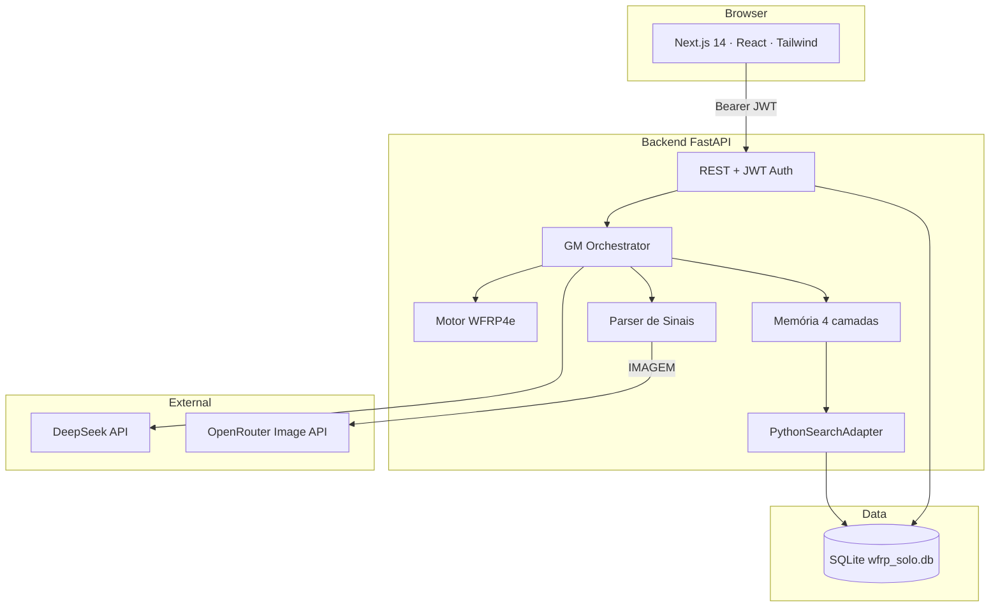
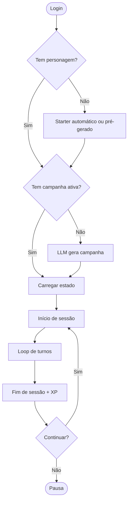
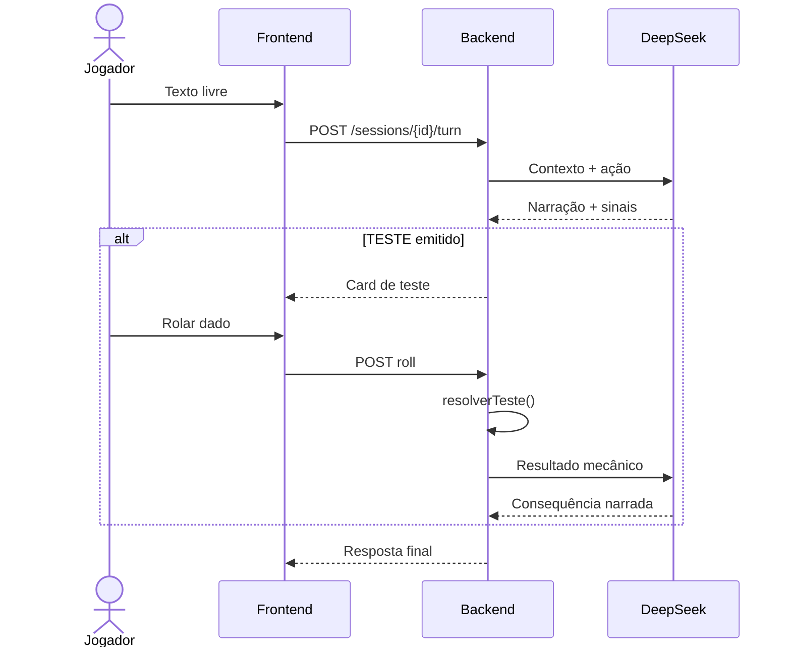

# Arquitetura — WFRP Solo

**Versão:** 2.1 (SQLite-only)  
**Data:** 2026-06-22

Este documento reúne arquitetura, separação frontend/backend e fluxos principais do sistema.

---

## Princípio central

> Para o jogador, deve ser irrelevante se o mestre é humano ou IA.

Três camadas independentes:

| Camada | Responsável | Exemplo |
|--------|-------------|---------|
| **Regras** | Código Python determinístico | Rolagem d100, wounds, XP |
| **Narrativa** | LLM (DeepSeek) | Descrição de cenas, diálogos |
| **Memória** | SQLite + busca Python | NPCs, eventos, resumos de sessão |

O frontend **nunca** rola dados nem chama a LLM diretamente.

---

## Diagrama de componentes



---

## Protocolo de sinais (LLM → backend)

A LLM emite blocos JSON com tags. O backend parseia e executa mecanicamente:

| Sinal | Ação do backend |
|-------|-----------------|
| `[TESTE]` | Monta teste; aguarda rolagem do jogador; resolve server-side |
| `[IMAGEM]` | Enfileira job OpenRouter FLUX.2 Klein (assíncrono) |
| `[FIM_SESSAO]` | Resumo, XP, karma, journal |
| `[NOVA_CAMPANHA]` | Metadados de campanha |
| `[ESTADO_COMBATE]` | Modo combate, iniciativa, turnos |
| `[ACAO_SISTEMA]` | Morte, transições de estado |

Prompt completo: [`gm-system-prompt.md`](gm-system-prompt.md).

---

## Memória em quatro camadas

1. **Fatos relacionais** — personagem, campanha, NPCs, inventário (SQLite)
2. **Busca semântica** — embeddings JSON + cosine similarity em Python
3. **Resumos comprimidos** — summaries de sessão injetados no contexto LLM
4. **Histórico do turno** — últimos N turnos da sessão ativa

---

## Fluxo de campanha



---

## Fluxo de turno (exploração)



---

## Estrutura do repositório

```
SoloRPG/
├── backend/app/
│   ├── api/          # Rotas REST + auth
│   ├── rules/        # Motor WFRP4e (dice, combat, fate, XP)
│   ├── llm/          # Adapter DeepSeek, prompts, sinais
│   ├── services/     # Orchestrator, sessão, campanha, personagem
│   └── db/           # Models SQLAlchemy
├── frontend/src/
│   ├── app/          # Páginas Next.js (App Router)
│   ├── components/   # UI sessão, sidebars, dado 3D
│   └── lib/          # API client, i18n
├── openspec/         # Propostas e specs (OpenSpec)
└── Docs/             # Documentação de referência
```

---

## Autenticação e isolamento

- JWT Bearer (`Authorization` header), expiração 7 dias
- Personagens, campanhas e sessões vinculados a `user_id`
- **Dev:** usuário master `dev` / `dev` (`APP_ENV=development`)
- **Prod:** register → código por e-mail → verify → starter automático

---

## Integrações externas

| Serviço | Uso | Variáveis |
|---------|-----|-----------|
| DeepSeek | GM narrativo | `DEEPSEEK_API_KEY`, `LLM_PROVIDER` |
| SQLite | Persistência (único backend) | `DATABASE_URL` |
| OpenRouter Image API | Ilustrações | `OPENROUTER_API_KEY`, `OPENROUTER_IMAGE_MODEL` |
| SMTP | Verificação de e-mail (prod) | `SMTP_*`, `EMAIL_PROVIDER=smtp` |

---

## Desenvolvimento

O projeto segue **OpenSpec**: cada feature começa como proposta em `openspec/changes/`, implementada via `/openspec-apply`, e arquivada em `openspec/changes/archive/`.

Convenções: PT-BR na UI, regras sempre server-side, testes pytest + Playwright E2E.
