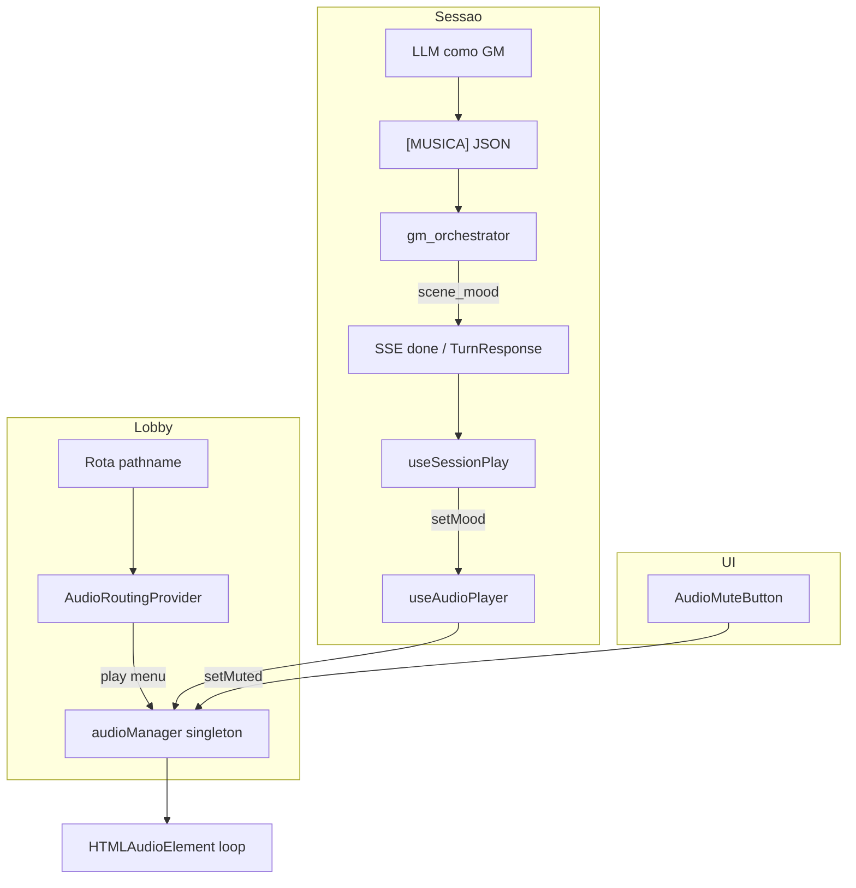

# Motor de áudio ambiente — WFRP Solo

**Versão:** 1.1  
**Data:** 2026-06-26  
**Relacionado:** [`gm-system-prompt.md`](gm-system-prompt.md) (sinal `[MUSICA]`), OpenSpec `add-ambient-audio-engine`, `restrict-menu-audio-out-of-play`, `preserve-menu-audio-across-routes`, `fix-audio-mute-routing-regression`

---

## 1. Objetivo

O motor de áudio fornece **trilha ambiente de fundo** — não música em primeiro plano. O volume é propositalmente baixo (menu ~12%, tensão in-game ~8%) para orientar o jogador emocionalmente na cena sem competir com a leitura da narrativa.

Há **duas camadas independentes**:

| Camada | Onde toca | Quem controla | Faixas |
|--------|-----------|---------------|--------|
| **Menu / lobby** | Telas fora de `/play/` | Roteamento por URL (`AudioRoutingProvider`) | Theme (2 variantes) |
| **Sessão in-game** | Apenas `/play/{sessionId}` | GM via sinal `[MUSICA]` → `scene_mood` | 8 moods + `normal` (ver §7) |

O jogador pode **silenciar tudo** a qualquer momento. A preferência persiste em `localStorage` entre sessões e rotas.

---

## 2. Experiência do jogador

### Lobby (meta-jogo)

- Ao navegar em rotas permitidas (`/character`, `/campaigns`, `/progression`, login, etc.), a trilha **Theme** pode iniciar em loop.
- Ao trocar entre telas de lobby (ex.: personagens → campanhas), a música **continua** — não reinicia do zero.
- Ao entrar em `/play/...`, a trilha de menu **para imediatamente**.
- Ao sair da sessão de jogo de volta ao lobby, a trilha de menu **retoma** (se o som não estiver silenciado).

### Sessão de jogo

- Por padrão, **silêncio** in-game — nenhuma música até o GM emitir o sinal.
- Quando a narrativa muda de tom, o GM emite `[MUSICA]` com um dos moods in-game (`tensão`, `combate`, `exploração`, etc.).
- Quando o tom passa, o GM emite `mood: "normal"` e a reprodução **para**.
- Se o turno não incluir `[MUSICA]`, o mood atual **permanece** (comportamento *sticky*).

### Silenciar

- Botão **Silenciar / Ativar som** em login, `AppShell` (lobby autenticado) e tela de sessão.
- Silenciar para **qualquer** trilha (menu ou tensão), imediatamente.
- A preferência sobrevive a refresh, navegação e logout/login.
- Logout também chama `stop()` — garante que nada continua tocando após sair da conta.

---

## 3. Arquitetura



**Princípio:** narrativa e decisão de mood = LLM · parsing e repasse = backend · reprodução = frontend singleton. O backend **nunca** serve stream de áudio em tempo real — apenas propaga `scene_mood` como metadado do turno.

---

## 4. Assets e deploy

### Origem dos arquivos

```
audio/                          # raiz do repositório (fonte)
├── Solo RPG Theme.mp3           # menu
├── Solo RPG Theme 2.mp3
├── Solo RPG - Tension.mp3       # tensão
├── Solo RPG - Tension 2.mp3
├── SoloRPG - Combat.mp3         # combate
├── SoloRPG - Combat 2.mp3
├── SoloRPG - Exploration.mp3    # exploração
├── SoloRPG - Exploration 2.mp3
├── SoloRPG - Investigation.mp3  # investigação
├── SoloRPG - Investigation 2.mp3
├── SoloRPG - Horror.mp3         # horror (sobrenatural, pool ×2)
├── SoloRPG - Horror 2.mp3
├── SoloRPG - Horror Chaos.mp3   # horror_caos (Caos/Ruína, pool ×2)
├── SoloRPG - Horror Chaos 2.mp3
├── SoloRPG - Social.mp3         # social
├── SoloRPG - Social 2.mp3
├── SoloRPG - Journey.mp3        # jornada
└── SoloRPG - Journey 2.mp3
```

**Horror:** dois moods com pools separados de 2 faixas cada — `horror` (`Horror` + `Horror 2`) vs `horror_caos` (`Horror Chaos` + `Horror Chaos 2`). O GM escolhe o mood; o sistema sorteia dentro do pool.

### Desenvolvimento local

```bash
cd frontend
npm run prepare:audio   # copia audio/*.mp3 → frontend/public/audio/
```

Sem esse passo, as URLs `/audio/...` retornam 404 em dev.

### Docker / produção

O `frontend/Dockerfile` faz `COPY audio ./public/audio/` e valida a presença de `Solo RPG Theme.mp3` no build.

### Seleção de faixa

Dentro de cada categoria com duas faixas, o `audioManager` escolhe **aleatoriamente** uma variante ao iniciar reprodução — inclusive `horror` e `horror_caos`, cada um com pool próprio.

---

## 5. Frontend

### 5.1 `audioManager.ts` — singleton

Arquivo: `frontend/src/lib/audio/audioManager.ts`

Responsabilidades:

- Uma única instância `<audio>` audível por vez (`currentAudio`, `currentCategory`).
- `play(category)` idempotente: segundo `play("menu")` com menu já tocando não cria novo elemento.
- `playGeneration`: invalida promises assíncronas em curso quando `stop()` ou `setMuted(true)` — evita faixas órfãs sobrepostas.
- `currentAudio` só é commitado **após** `await audio.play()` bem-sucedido e checagens de geração/mute/rota.
- Autoplay bloqueado pelo browser (`NotAllowedError`): agenda retry no primeiro `click` ou `keydown` do usuário.
- Volume fixo por categoria (não exposto ao jogador).

API pública:

| Método | Descrição |
|--------|-----------|
| `play(category)` | Inicia loop da categoria (`menu`, `tensao`, `combate`, …) |
| `stop()` | Para e descarta reprodução atual |
| `isMuted()` | Lê preferência (síncrono, com cache + `localStorage`) |
| `setMuted(bool)` | Persiste e, se `true`, para tudo |
| `isAudiblyPlaying()` | `true` se há elemento `<audio>` não pausado |
| `subscribe(listener)` | Notifica mudanças de mute (React hooks) |

Chave `localStorage`: `wfrp-audio-muted` (`"true"` / ausente).

### 5.2 `audioRoutes.ts` — allowlist de lobby

Arquivo: `frontend/src/lib/audio/audioRoutes.ts`

- `isInGameRoute(path)` → `path.startsWith("/play/")`
- `isMenuAudioRoute(path)` → rota na allowlist (`/`, `/login`, `/character`, `/campaigns`, `/progression`, `/session/end`, `/session/death`, etc.)
- Rotas **fora** da allowlist não disparam trilha de menu (ex.: `/settings` futuro).

### 5.3 `AudioRoutingProvider`

Arquivo: `frontend/src/app/providers.tsx`

Montado em `Providers` — envolve toda a app. Reage a `pathname` e `muted`.

Lógica (ordem):

1. Se mutado **ou** rota in-game → `stop()` e retorna.
2. Se rota **não** está na allowlist de menu → `stop()` e retorna.
3. Se navegação **menu → menu** e já há áudio tocando → **não** chama `playMenu()` (continuidade).
4. Caso contrário → `playMenu()`.

Usa `audioManager.isMuted()` síncrono (não só estado React) para evitar race após silenciar.

### 5.4 `useAudioPlayer`

Arquivo: `frontend/src/hooks/useAudioPlayer.ts`

| Função | Comportamento |
|--------|---------------|
| `setMood(mood)` | Delega a `resolveMoodAction()` → `play(category)` ou `stop()` |
| `playMenu()` | Delega a `audioManager.play("menu")` |
| `stop()` | Delega a `audioManager.stop()` |

Moods desconhecidos ou `scene_mood` fora de `/play/` são ignorados silenciosamente.

### 5.5 `audioMoods.ts` — mapa mood → categoria

Arquivo: `frontend/src/lib/audio/audioMoods.ts`

- `MOOD_TO_CATEGORY`: traduz `scene_mood` do GM para `AudioCategory` interna.
- `resolveMoodAction()`: lógica pura usada por `useAudioPlayer` (play/stop/noop + guarda de rota/mute).

### 5.6 `useSessionPlay` — ponte GM → áudio

Arquivo: `frontend/src/hooks/useSessionPlay.ts`

No processamento do turno (`applyMeta`), se `result.scene_mood` estiver presente:

```typescript
if (result.scene_mood) {
  setMood(result.scene_mood);
}
```

Isso conecta o SSE/`TurnResponse` do backend ao hook de áudio **após** a narrativa do turno ser aplicada na UI.

### 5.7 `AudioMuteButton`

Arquivo: `frontend/src/components/audio/AudioMuteButton.tsx`

Presente em:

- `AppShell` (usuário autenticado no lobby)
- `/login`
- `/play/[sessionId]`

i18n: `audio.mute`, `audio.unmute`, `audio.muteTitle`, `audio.unmuteTitle` em `pt-BR.json`.

---

## 6. Backend

### 6.1 Parser de sinais

Arquivo: `backend/app/llm/signals.py`

A tag `MUSICA` está registrada no regex de sinais estruturados, junto com `TESTE`, `IMAGEM`, `FIM_SESSAO`, etc.

### 6.2 Orchestrator

Arquivo: `backend/app/services/gm_orchestrator.py` + whitelist em `backend/app/services/audio_moods.py`

```python
elif signal.tag == "MUSICA":
    mood = signal.payload.get("mood")
    if mood in IN_GAME_MOODS:
        result.scene_mood = mood
```

Moods aceitos (`IN_GAME_MOODS`): `tensão`, `combate`, `exploração`, `investigação`, `horror`, `horror_caos`, `social`, `jornada`, `normal`. Valores fora da whitelist são **descartados**.
- `TurnResult.scene_mood: str | None` — `None` quando não há sinal no turno.
- Repassado no payload SSE `done` e em `TurnResponse` (`backend/app/schemas/api.py`).

O backend **não valida** o campo `descricao` — é informativo para logs/debug futuro e para orientar o GM na redação; o frontend ignora hoje.

---

## 7. Prompt do GM — sinal `[MUSICA]`

Documentação autoritativa do formato: [`gm-system-prompt.md`](gm-system-prompt.md) § *Trilha Sonora Ambiente*.

### 7.1 Papel narrativo

O GM decide **quando o tom emocional da cena muda**. O áudio reforça a imersão; não substitui a prosa. O GM deve:

- Emitir `[MUSICA]` na **transição** de tom, não a cada parágrafo.
- Usar `"normal"` quando a tensão **termina de fato** (refúgio, fuga bem-sucedida, combate encerrado).
- **Não** emitir `[MUSICA]` em cenas neutras — silêncio in-game é o default.

### 7.2 Formato obrigatório

```
[MUSICA]
{"mood":"tensão","descricao":"Perseguição pelos becos de Ubersreik à noite"}
[/MUSICA]
```

| Campo | Obrigatório | Valores aceitos |
|-------|-------------|-----------------|
| `mood` | Sim | `tensão`, `combate`, `exploração`, `investigação`, `horror`, `horror_caos`, `social`, `jornada`, `normal` |
| `descricao` | Sim (prompt) | Texto livre breve — contexto da cena |

**Erros comuns que o parser ignora:**

- Texto livre entre tags (sem JSON)
- `"tenso"` em vez de `"tensão"`
- Tag de fechamento ausente `[/MUSICA]`

### 7.3 Tabela de moods

| `mood` | Trilha | Volume | Quando usar |
|--------|--------|--------|-------------|
| `tensão` | Tension (×2) | 8% | Perigo iminente sem combate aberto |
| `combate` | Combat (×2) | 9% | Combate mecânico ativo |
| `exploração` | Exploration (×2) | 7% | Ruína/masmorra sem perigo imediato |
| `investigação` | Investigation (×2) | 6% | Pistas, vigilância, dedução |
| `horror` | Horror (×2) | 7% | Sobrenatural sem Caos dominante |
| `horror_caos` | Horror Chaos (×2) | 7% | Caos, warp, corrupção, rituais profanos |
| `social` | Social (×2) | 6% | Refúgio relativo (raro) |
| `jornada` | Journey (×2) | 6% | Viagem em deslocamento |
| `normal` | — | — | Para qualquer trilha in-game |

### 7.4 Horror: dois moods, quatro faixas

- `horror` → pool `SoloRPG - Horror.mp3` + `Horror 2.mp3` — mortos-vivos, espectros, maldições, império antigo.
- `horror_caos` → pool `SoloRPG - Horror Chaos.mp3` + `Horror Chaos 2.mp3` — corrupção, mutação, símbolos do Caos, warp.

O GM escolhe o mood; o sistema sorteia uma variante dentro do pool. Pools **não** se misturam.

### 7.5 Quando usar `"normal"`

- Ameaça passou; personagem em relativa segurança
- Fim de combate ou perseguição
- Transição para cena calma onde o silêncio ajuda a respirar

### 7.6 Comportamento sticky

Se o GM **não** envia `[MUSICA]` num turno:

- `scene_mood` no response é `null`
- O frontend **não** chama `setMood`
- A trilha atual **continua** até um `"normal"` explícito, troca de mood ou saída de `/play/`

Isso evita flicker quando vários turnos consecutivos permanecem tensos sem nova transição.

### 7.7 Impacto no restante do prompt

`[MUSICA]` segue as mesmas regras de formato dos outros sinais (`[TESTE]`, `[IMAGEM]`):

- JSON válido entre tags
- Não inventar resultados mecânicos — áudio é **puramente atmosférico**
- Pode aparecer antes ou depois da narração do turno, desde que no mesmo response

O GM **não precisa** mencionar música na prosa visível ao jogador; o sinal é invisível na UI (não renderizado no chat).

---

## 8. Fluxos completos (exemplos)

### 8.1 Lobby → sessão → lobby

```
/campaigns     → AudioRoutingProvider → play("menu") Theme
/play/abc      → AudioRoutingProvider → stop() (menu para)
                 GM emite tensão       → play("tensao") Tension
                 GM emite normal       → stop()
/campaigns     → AudioRoutingProvider → play("menu") Theme (nova faixa ou mesma, se ainda em memória)
```

### 8.2 Mute durante sessão

```
/play/abc      → tensão tocando
Jogador clica Silenciar → setMuted(true) → stop() + playGeneration++
GM emite tensão no turno seguinte → setMood ignorado (isMuted)
Jogador Ativar som → setMuted(false) — tensão NÃO retoma até novo sinal GM
```

### 8.3 Autoplay bloqueado (browser)

```
Primeira visita /campaigns → play() → NotAllowedError
Jogador clica em qualquer lugar → retry → play("menu") OK
```

---

## 9. Testes automatizados

```bash
cd frontend && npm run test:unit
```

Arquivo: `frontend/src/lib/audio/audioManager.test.ts`

| Suite | O que valida |
|-------|----------------|
| `audioManager mute` | persistência, no-op quando mutado, bloqueio menu em `/play/` |
| `audioManager menu continuity` | idempotência, troca tensão, stop+replay |
| `audioManager in-game moods` | horror vs horror_caos, troca de categoria, idempotência |
| `audioMoods` | mapa mood → categoria, resolveMoodAction |

Arquivo: `frontend/src/lib/audio/audioRoutes.test.ts` — normalização de path e allowlist.

Backend: `backend/tests/test_audio_mood_signal.py` — whitelist e `_handle_signal` MUSICA.

Specs OpenSpec: `openspec/specs/audio-routing/spec.md`, `openspec/specs/audio-mood-signal/spec.md`.

---

## 10. Troubleshooting

| Sintoma | Causa provável | Ação |
|---------|----------------|------|
| Sem som no lobby | Autoplay bloqueado | Interagir (clique/tecla); ver retry no console |
| Sem som no lobby | `prepare:audio` não rodou | `npm run prepare:audio` |
| Sem som in-game | GM não emitiu `[MUSICA]` | Esperado — silêncio é default |
| Sinal ignorado | JSON inválido ou mood errado | Corrigir prompt; usar `"tensão"` com acento |
| Duas faixas sobrepostas | Regressão async (pré-fix) | Verificar `playGeneration` em `audioManager.ts` |
| Mute não persiste | localStorage bloqueado | Modo privado / extensões |
| Theme na sessão | Bug roteamento | Verificar `isInGameRoute` em `AudioRoutingProvider` |

---

## 11. Referência rápida de arquivos

| Arquivo | Papel |
|---------|-------|
| `audio/*.mp3` | Fonte das faixas |
| `frontend/src/lib/audio/audioManager.ts` | Motor singleton |
| `frontend/src/lib/audio/audioMoods.ts` | Mapa mood GM → categoria |
| `frontend/src/lib/audio/audioRoutes.ts` | Allowlist lobby |
| `frontend/src/app/providers.tsx` | Roteamento menu |
| `frontend/src/hooks/useAudioPlayer.ts` | API React play/stop/mood |
| `frontend/src/hooks/useAudioMute.ts` | Estado mute |
| `frontend/src/hooks/useSessionPlay.ts` | Consome `scene_mood` |
| `frontend/src/components/audio/AudioMuteButton.tsx` | UI silenciar |
| `frontend/src/contexts/AuthContext.tsx` | `stop()` no logout |
| `backend/app/services/audio_moods.py` | Whitelist `IN_GAME_MOODS` |
| `backend/app/llm/signals.py` | Parser tag MUSICA |
| `backend/app/services/gm_orchestrator.py` | `scene_mood` |
| `backend/app/schemas/api.py` | `TurnResponse.scene_mood` |
| `Docs/gm-system-prompt.md` | Instruções ao GM |
