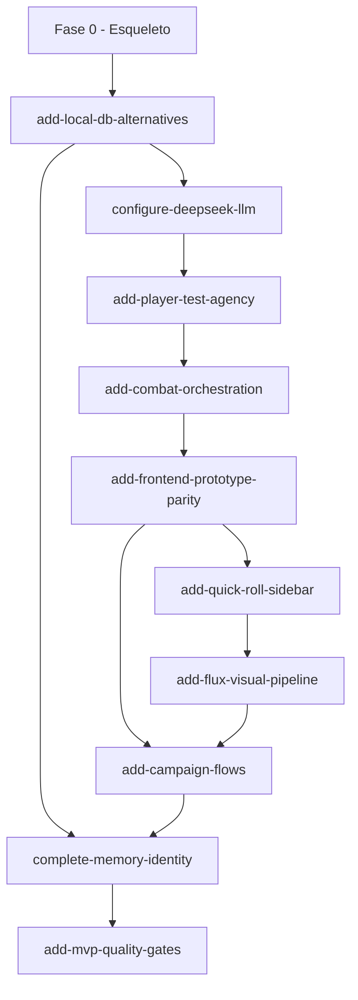

# Ordem de Desenvolvimento — WFRP Solo

**Versão:** 1.1  
**Data:** 2026-06-13  
**Referências:** `Docs/README.md`, `Docs/ux-spec.md`, protótipo Open Design, propostas OpenSpec em `openspec/changes/`

Este documento define a sequência recomendada para completar o MVP jogável, com dependências entre entregas e o comando OpenSpec correspondente a cada fase.

---

## Visão geral

```
Fase 0 ─ Fundação (já parcialmente feita)
   │
Fase 1 ─ Destravar ambiente local + DeepSeek
   │
Fase 2 ─ Loop de jogo core (testes + combate)
   │
Fase 3 ─ Frontend completo (protótipo OD + quick roll)
   │
Fase 4 ─ Assets visuais (Flux)
   │
Fase 5 ─ Campanha completa (fluxos + memória)
   │
Fase 6 ─ Qualidade e fechamento do MVP
```

Cada fase só deve começar quando a anterior estiver funcional o suficiente para testar manualmente.

---

## Fase 0 — Esqueleto (concluída parcialmente)

**Objetivo:** provar que o stack roda e o loop básico existe.

| Item | Status | OpenSpec |
|------|--------|----------|
| Monorepo Next.js + FastAPI | ✓ | `add-wfrp-solo-mvp` |
| Motor de regras WFRP4e (d100, combate, fate, XP) | ✓ core | `add-wfrp-solo-mvp` |
| APIs REST (personagem, campanha, sessão, turno) | ✓ | `add-wfrp-solo-mvp` |
| GM orchestrator + parser de sinais | ✓ parcial | `add-wfrp-solo-mvp` |
| Frontend mínimo (chat + sidebars) | ✓ parcial | `add-wfrp-solo-mvp` |
| Painéis laterais fixos | ✓ | `fix-session-sidebar-layout` |

**Gaps conhecidos da Fase 0:** PostgreSQL obrigatório, mock LLM default, testes automáticos incompletos, várias tasks marcadas `[x]` sem código equivalente.

---

## Fase 1 — Fundação operacional

**Objetivo:** subir backend + frontend no Fedora sem Docker, com DeepSeek respondendo de verdade.

**Ordem:**

1. **`add-local-db-alternatives`**  
   - Perfil `sqlite-dev` para dev imediato  
   - Perfis `postgres` / `supabase` documentados  
   - `/health` com diagnóstico de banco  
   - Script `scripts/check-dev.sh`  

2. **`configure-deepseek-llm`**  
   - Default `LLM_PROVIDER=deepseek`, `LLM_MODEL=deepseek-chat`  
   - Streaming SSE real (não simulado)  
   - Frontend consumindo stream  

**Critério de pronto:**  
```bash
# Backend sobe sem Docker
DATABASE_PROFILE=sqlite-dev uvicorn app.main:app --reload

# Sessão responde com narrativa DeepSeek (não mock)
curl http://localhost:8000/health
```

**Dependências:** nenhuma (primeira prioridade).

**Estimativa relativa:** 1–2 dias.

---

## Fase 2 — Loop de jogo core

**Objetivo:** mecânica de mesa fiel ao product-brief §6 e combate funcional.

**Ordem:**

3. **`add-player-test-agency`**  
   - GM emite `[TESTE]` → UI mostra card + botão **"Rolar dado"**  
   - Endpoint separado para rolagem server-side  
   - GM só narra consequência depois do resultado visível  

4. **`add-combat-orchestration`**  
   - Handler `[ESTADO_COMBATE]`  
   - Iniciativa, turnos, transição EXPLORACAO ↔ COMBATE  
   - Contador de turno na sidebar esquerda  

**Critério de pronto:**  
- Jogador escolhe quando rolar  
- Combate com turnos visíveis e estado persistido  
- DeepSeek narrando após cada resultado mecânico  

**Dependências:** Fase 1 (DeepSeek + DB).

**Estimativa relativa:** 3–5 dias.

---

## Fase 3 — Frontend completo (protótipo Open Design)

**Objetivo:** paridade visual e de fluxo com protótipo OD e `Docs/ux-spec.md`. Ver `Docs/prototype-gap-analysis.md`.

**Ordem (após Fase 2):**

5. **`add-frontend-prototype-parity`** *(substitui `add-immersive-session-ui`)*  
   - Design system WFRP (tokens, fontes)  
   - 9 telas: landing, home, character, campaigns, play, end, progression, death  
   - Sessão: chat imersivo, test-block, dice overlay, sidebars, resize, prepare overlay  

6. **`add-quick-roll-sidebar`**  
   - Rolagens rápidas na sidebar + popover + API  

**Critério de pronto:**  
- Cada rota comparável ao protótipo OD correspondente  
- Sessão sem bubbles; wounds bar e diários com tabs  
- Quick roll funcional na sidebar  

**Dependências:** Fase 2 (test-block API), Fase 1 (streaming).

**Estimativa relativa:** 6–10 dias.

---

## Fase 4 — Assets visuais

**Objetivo:** ilustrações inline no chat.

7. **`add-flux-visual-pipeline`** *(provider migrado em `switch-to-cloudflare-workers-ai`)*  
   - Jobs assíncronos via Cloudflare Workers AI (`flux-1-schnell`)  
   - `SceneImage` inline no chat  
   - Mapas com `image_url` real  

**Critério de pronto:** Imagens carregam em background sem bloquear texto.

**Dependências:** Fase 3 (componente `SceneImage`).

**Estimativa relativa:** 2–4 dias.

---

## Fase 5 — Campanha completa

**Objetivo:** ciclo de vida completo da campanha e memória persistente de qualidade.

**Ordem:**

8. **`add-campaign-flows`** ✓  
   - Criação customizada de personagem  
   - Continuar campanha ativa (retoma sessão em andamento)  
   - Nova campanha: manter personagem vs criar novo  
   - Tela de progressão com lista de avanços  

9. **`complete-memory-identity`** ✓  
   - pgvector SQL em PostgreSQL  
   - `social_perception` atualizada  
   - Fortune Points com regras de gasto  
   - Alembic migrations  

**Critério de pronto:**  
- 3+ sessões na mesma campanha com coerência  
- Retomar de onde parou após fechar o browser  
- Progressão de XP entre sessões  

**Dependências:** Fases 1–4.

**Estimativa relativa:** 4–6 dias.

---

## Fase 6 — Qualidade e fechamento ✓

**Objetivo:** confiança para jogar campanhas reais e docs honestas.

10. **`add-mvp-quality-gates`** ✓  
   - Testes API (pytest) — `backend/tests/test_api_integration.py`  
   - E2E Playwright — `frontend/e2e/game-loop.spec.ts`  
   - README + `scripts/run-tests.sh`  
   - Reconciliar `add-wfrp-solo-mvp/tasks.md`  
   - Checklist manual DeepSeek — [`mvp-validation-checklist.md`](mvp-validation-checklist.md)  

11. **Arquivar OpenSpec** (pendente)  
    - Mover changes concluídas para `openspec/changes/archive/`  
    - Consolidar specs em `openspec/specs/`  

**Critério de pronto:**  
- ✓ Script local verde: `./scripts/run-tests.sh` (+ `RUN_E2E=1` para Playwright)  
- ✓ README permite setup em < 15 min  
- ⏳ Campanha 3–5 sessões DeepSeek — validação manual via checklist  

**Dependências:** Fases 1–5.

**Estimativa relativa:** 3–4 dias.

---

## Mapa de dependências



---

## Comandos OpenSpec por fase

| Fase | Comando |
|------|---------|
| 1 | `/openspec-apply add-local-db-alternatives` |
| 1 | `/openspec-apply configure-deepseek-llm` |
| 2 | `/openspec-apply add-player-test-agency` |
| 2 | `/openspec-apply add-combat-orchestration` |
| 3 | `/openspec-apply add-frontend-prototype-parity` |
| 3 | `/openspec-apply add-quick-roll-sidebar` |
| 4 | `/openspec-apply add-flux-visual-pipeline` |
| 5 | `/openspec-apply add-campaign-flows` |
| 5 | `/openspec-apply complete-memory-identity` |
| 6 | `/openspec-apply add-mvp-quality-gates` |

---

## O que NÃO fazer fora de ordem

| Tentativa | Por quê esperar |
|-----------|-----------------|
| Flux antes de DeepSeek + DB | Imagens dependem de sessão estável |
| UI protótipo antes do test-block API | Test-block depende de `add-player-test-agency` |
| pgvector antes de sqlite-dev | Dev bloqueado sem Postgres |
| E2E antes do loop de roll | Testes vão quebrar a cada refactor |

---

## Configuração mínima para começar (Fase 1)

```env
# backend/.env
DATABASE_PROFILE=sqlite-dev
LLM_PROVIDER=deepseek
DEEPSEEK_API_KEY=sua-chave
LLM_MODEL=deepseek-chat
CORS_ORIGINS=http://localhost:3000

# frontend/.env.local
NEXT_PUBLIC_API_URL=http://localhost:8000
```

---

## Métrica de sucesso final (product-brief)

- Campanha de 3–5 sessões jogável sem quebrar imersão  
- DeepSeek mantém coerência narrativa entre sessões  
- Morte de personagem gera impacto (Fate Points esgotados)  
- Jogador volta espontaneamente para uma segunda campanha  
