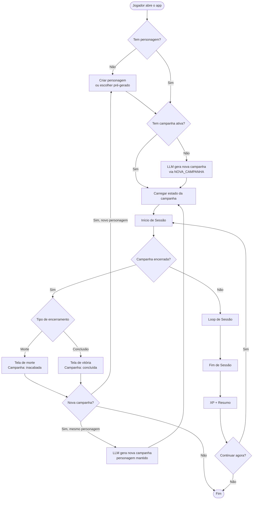
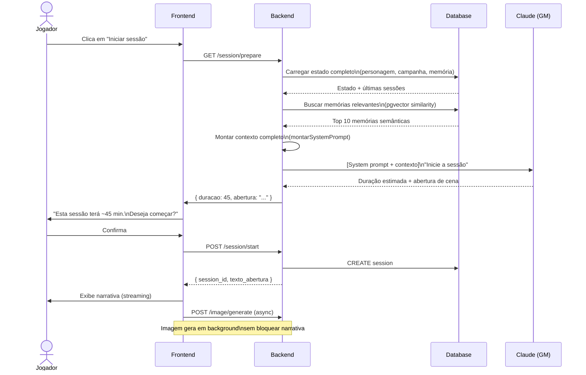
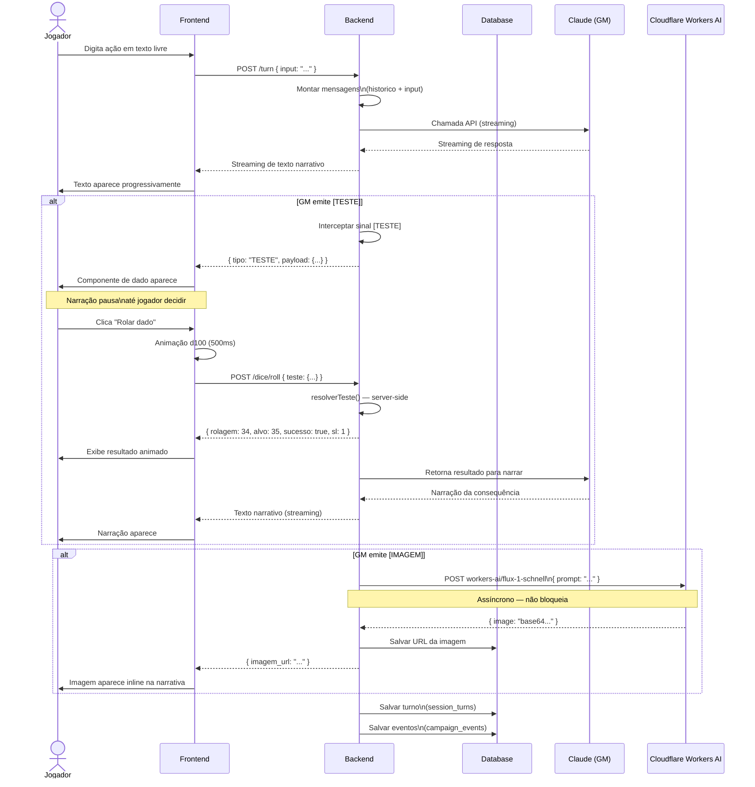
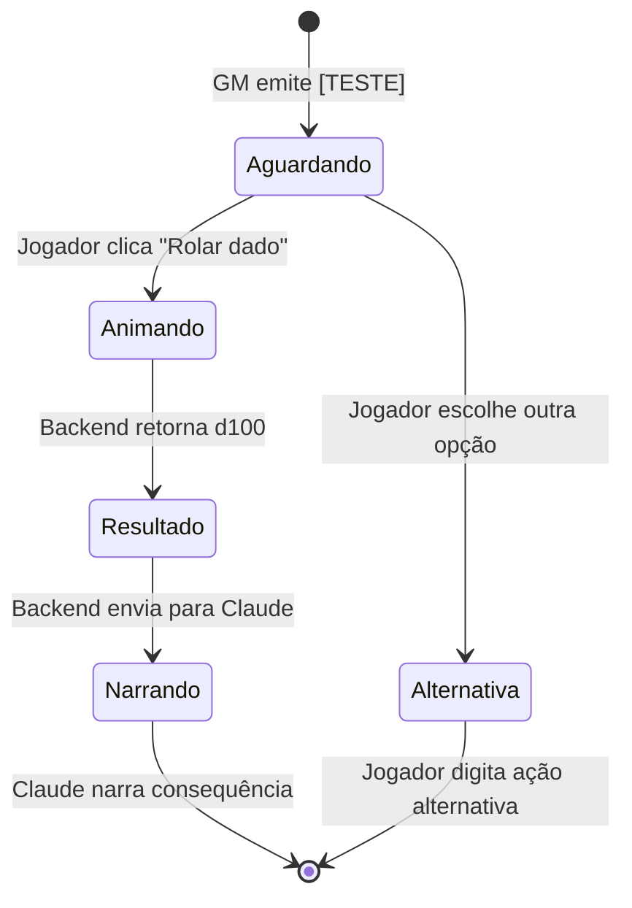
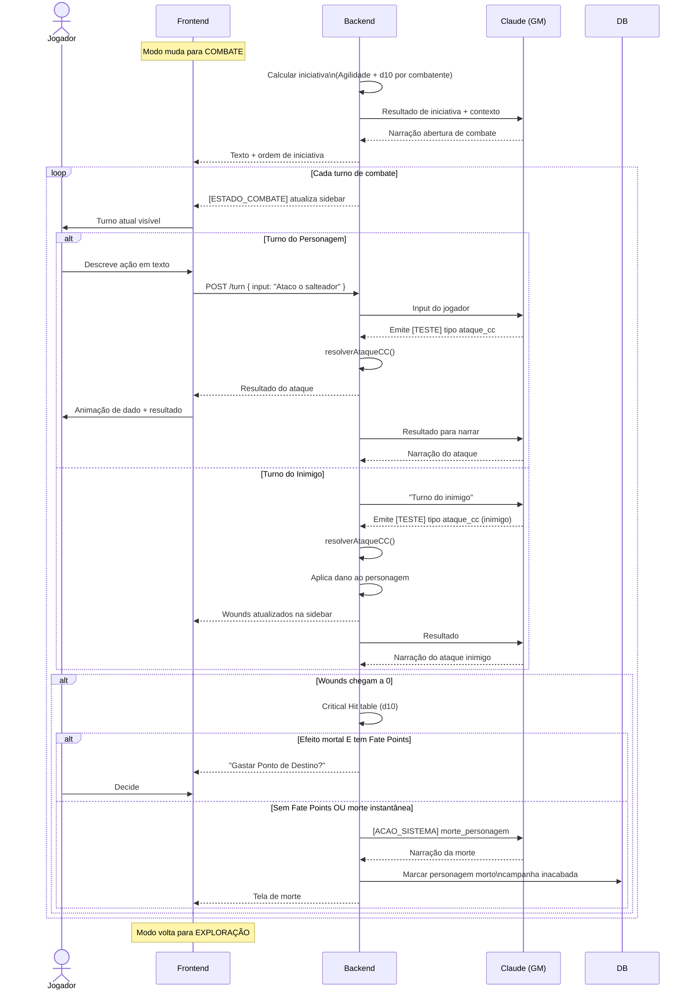
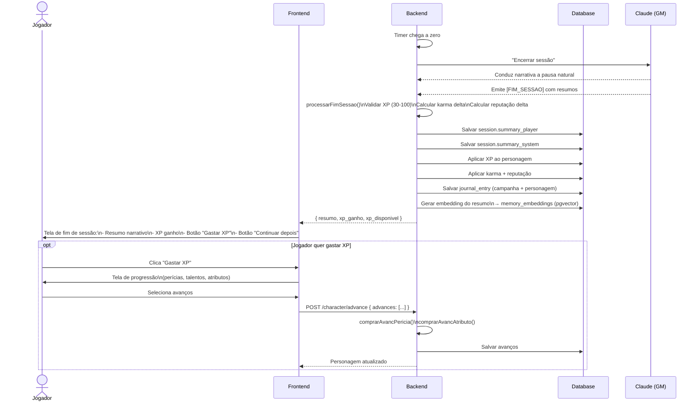
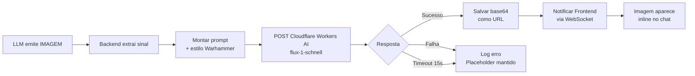
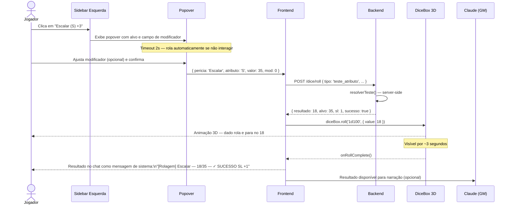

# Fluxo de Sessão — WFRP Solo
**Versão:** 1.0
**Data:** 2026-06-13
**Formato:** Mermaid

---

## 1. Fluxo Geral de Campanha

---

## 2. Fluxo de Início de Sessão

---

## 3. Fluxo de Turno — Exploração

---

## 4. Fluxo de Teste — Detalhe

---

## 5. Fluxo de Combate

---

## 6. Fluxo de Fim de Sessão

---

## 7. Fluxo de Geração de Imagem (Assíncrono)

---

## 8. Fluxo de Quick Roll (Clique na Sidebar)

