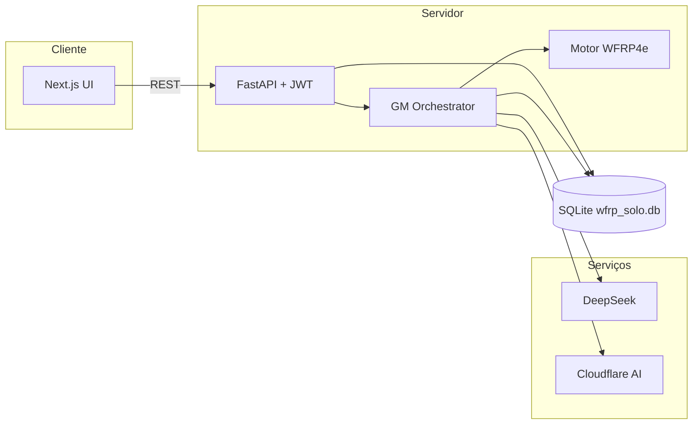

# WFRP Solo

Aplicação web de **RPG solo** baseada em **Warhammer Fantasy Roleplay 4ª edição (WFRP4e)**. Uma LLM atua como **Game Master sintético** — narra, reage e conduz campanhas completas com memória persistente entre sessões. O jogador interage **apenas por texto livre**, como numa mesa de RPG real.

**Princípio:** para o jogador, deve ser irrelevante se o mestre é humano ou IA.

---

## Para que serve

| Uso | Descrição |
|-----|-----------|
| **Jogar solo** | Campanhas WFRP4e sem grupo ou GM humano |
| **Sessões pausáveis** | Timer visível; retome de onde parou |
| **Trilha ambiente** | Menu só no lobby (~12% volume), tensão in-game via `[MUSICA]` (~8%); trilha **não reinicia** ao trocar telas de lobby; botão **Silenciar** global (persiste entre rotas); uma faixa audível por vez |
| **Progressão real** | XP, perícias e talentos entre sessões; contador de avanços persistido corretamente no backend |
| **Teste controlado** | Contas isoladas por usuário; fase 1 com pré-gerados + starter automático |

**Loop típico:** login → personagem → campanha → sessão (texto + rolagens) → recap + XP → progressão.

---

## Stack

| Camada | Tecnologia |
|--------|------------|
| Frontend | Next.js 14 (App Router), React, TailwindCSS, TypeScript |
| Backend | Python 3, FastAPI, SQLAlchemy (async) |
| Banco | SQLite (arquivo `wfrp_solo.db`) |
| LLM | DeepSeek (`deepseek-chat`) — adapter mock / Anthropic |
| Imagens | Cloudflare Workers AI (FLUX.1 Schnell), fila assíncrona |
| Auth | JWT; fase 1: conta fixa `admin` + `ADMIN_PASSWORD` |
| Deploy | Vercel + Railway (PaaS) ou VPS Debian ([guia](Docs/debian-server-install.md)) |

---

## Como foi desenvolvido

O projeto segue metodologia **OpenSpec**: cada feature nasce como proposta em `openspec/changes/`, é implementada com `/openspec-apply` e arquivada quando concluída.

**Convenções:**

- Regras WFRP4e **sempre no backend** — a LLM nunca rola dados nem calcula ferimentos
- Protocolo de **sinais JSON** (`[TESTE]`, `[IMAGEM]`, `[MUSICA]`, `[FIM_SESSAO]`, …) entre LLM e código
- Interface em **PT-BR** (i18n desde o início)
- Testes: **pytest** (API + regras, incl. progressão multi-compra) e **Playwright** (loop E2E); `npm run test:unit` no frontend (áudio, roteamento mute, dice `safeClear`)

Documentação de produto e prompts em [`Docs/`](Docs/README.md). Especificações ativas em `openspec/changes/`.

---

## Arquitetura



**Separação:** narrativa = LLM · mecânica = Python · memória = banco.

Detalhes, fluxos de sessão e estrutura de pastas: **[Docs/architecture.md](Docs/architecture.md)**

---

## Instalação local (desenvolvimento)

### Pré-requisitos

```bash
chmod +x scripts/check-dev.sh
./scripts/check-dev.sh
```

Python 3.11+, Node 20+, npm.

### 1. Backend

```bash
cd backend
python3 -m venv .venv
source .venv/bin/activate
pip install -r requirements.txt
cp ../.env.example .env
# Edite: ADMIN_PASSWORD (≥8 chars), DEEPSEEK_API_KEY ou LLM_PROVIDER=mock
uvicorn app.main:app --reload --port 8000
```

### 2. Frontend

```bash
cd frontend
npm install
npm run prepare:dice
npm run prepare:audio
cp ../.env.example .env.local
npm run dev
```

`prepare:dice` copia assets do DiceBox (incl. `ammo.wasm.wasm`) para `public/assets/dice-box/`.  
`prepare:audio` copia os MP3 de `audio/` (raiz) para `frontend/public/audio/` — necessário em dev local; no Docker o build faz isso automaticamente.

Acesse **http://localhost:3000**

### Login (fase 1)

Com `AUTH_MODE=fixed_admin` (padrão), defina `ADMIN_PASSWORD` no `backend/.env` (mín. 8 caracteres) e entre em `/login` **somente com a senha**. O usuário fixo é `admin` (`admin@wfrp-solo.local`).

Cadastro e verificação por e-mail ficam desativados na fase 1. Para multi-conta, use `AUTH_MODE=multi_user` (fase 2).

### Personagens (fase 1)

Wizard custom **desligado** (`ENABLE_CUSTOM_CHARGEN=false`). Caminhos: **starter** (cadastro) + **pré-gerados** em `/character`.

---

## Variáveis de ambiente (resumo)

| Variável | Dev | Produção |
|----------|-----|----------|
| `APP_ENV` | `development` | `production` |
| `AUTH_MODE` | `fixed_admin` | `fixed_admin` (fase 1) |
| `ADMIN_PASSWORD` | senha local ≥8 chars | senha forte ≥8 chars |
| `DATABASE_URL` | `sqlite+aiosqlite:///./wfrp_solo.db` | caminho absoluto no servidor |
| `JWT_SECRET` | qualquer | string aleatória ≥32 chars |
| `EMAIL_PROVIDER` | `mock` | `smtp` (só `multi_user`) |
| `ENABLE_CUSTOM_CHARGEN` | `false` | `false` |
| `DEEPSEEK_API_KEY` | sua chave | sua chave |

Lista completa: [`.env.example`](.env.example)

---

## Testes

```bash
./scripts/run-tests.sh
RUN_E2E=1 ./scripts/run-tests.sh   # inclui Playwright
cd frontend && npm run test:unit    # áudio (mute, continuidade menu, regressão), dice safeClear, rotas WFRP
cd backend && pytest tests/test_rules.py tests/test_api_integration.py -q  # regras + API (progressão)
```

Validação manual de campanha: [`Docs/mvp-validation-checklist.md`](Docs/mvp-validation-checklist.md)

---

## Deploy

| Opção | Guia |
|-------|------|
| **Docker (VPS Debian/Ubuntu)** | [`Docs/debian-server-install.md`](Docs/debian-server-install.md) — Compose + SQLite no host |
| **PaaS** (Vercel + Railway) | Mesmas variáveis; backend com SQLite persistente |

Deploy local com Docker:

```bash
cp .env.docker.example .env   # edite secrets
docker compose up -d --build
```

O SQLite fica em `WFRP_DATA_DIR` (padrão `./data` no host).

---

## Changelog (últimas versões)

### [0.3.2] — 2026-06-24

- **Trilha sonora ambiente** — menu no lobby (12% volume); tensão in-game via `[MUSICA]` (8%); roteamento por rota; botão Silenciar global
- **Áudio no lobby** — trilha de menu continua ao navegar entre telas de lobby (`preserve-menu-audio-across-routes`); sem sobreposição de faixas; mute respeitado em todas as rotas (`fix-audio-mute-routing-regression`)
- **Sidebar de perícias** — tabela Nome | Atrib. | Adv. | Alvo; tooltip quando o nome trunca
- **Chat** — textarea auto-expansível (Enter envia, Shift+Enter quebra linha)
- **Quick roll** — rolagem só ao clicar em "Rolar agora" (sem countdown)
- **Inventário** — guarda no backend + regra no prompt GM contra itens inexistentes
- **Teste passivo de descoberta** — instrução no prompt GM (`obrigatorio: false`)
- **Dados 3D em produção** — `safeClear()`, fallback na UI, headers COOP/COEP, smoke check WASM no Docker
- **Progressão** — compras repetidas da mesma perícia acumulam `atual +N`; talentos owned mostram `· adquirido`
- **Assistente WFRP4e** — wizard multi-step (código pronto, UI desligada na fase 1)

Ver histórico completo: [`CHANGELOG.md`](CHANGELOG.md)

### [0.3.1] — 2026-06-23

- **Hotfix Docker** — `gm-system-prompt.md` copiado para o container; GM deixou de usar fallback mínimo em produção

### [0.3.0] — 2026-06-22

- **Login fixo fase 1** — `admin` + `ADMIN_PASSWORD`; register/verify desativados
- **Autenticação** — JWT, isolamento por conta (`multi_user` na fase 2), personagem starter
- **Fase 1 chargen** — wizard oculto; só pré-gerados + starter
- **SQLite-only** — banco único via arquivo `.db`; sem PostgreSQL/Docker

### [0.2.0] — 2026-06-21

- Mecânicas de **Destino e Fortuna** (regras completas + UI)
- **Dados 3D** (DiceBox) com init robusto
- **Guarda de créditos** Cloudflare para imagens de sessão
- **Roster de NPCs** no diário lateral
- Formato WFRP `4+[Fel]` na sidebar de perícias

### [0.1.0] — 2026-06-20

- **MVP inicial** — loop de jogo WFRP4e com GM sintético (DeepSeek)
- Backend FastAPI + motor de regras d100, combate, XP
- Frontend Next.js (chat, sidebars, sessão pausável)
- Personagens pré-gerados, campanhas, memória narrativa (SQLite + busca Python)

---

## Documentação

Índice: **[Docs/README.md](Docs/README.md)**

| Documento | Conteúdo |
|-----------|----------|
| [architecture.md](Docs/architecture.md) | Arquitetura, fluxos, pastas |
| [product-brief.md](Docs/product-brief.md) | Visão de produto e escopo MVP |
| [ux-spec.md](Docs/ux-spec.md) | Design visual (grimório, paleta, layout) |
| [database-schema.md](Docs/database-schema.md) | Schema SQLite + embeddings JSON |
| [gm-system-prompt.md](Docs/gm-system-prompt.md) | Persona e sinais do GM |
| [mvp-validation-checklist.md](Docs/mvp-validation-checklist.md) | QA manual campanha 3–5 sessões |
| [debian-server-install.md](Docs/debian-server-install.md) | Deploy passo a passo em Debian |

---

## Licença

Projeto pessoal — uso não comercial. WFRP4e é propriedade da Games Workshop / Cubicle 7.
