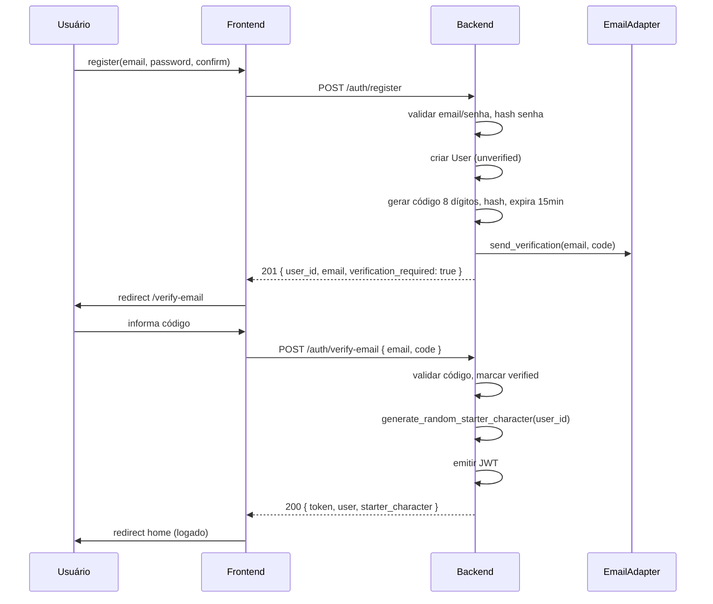

# Design: add-user-auth

## Context

**Estado atual**

- Nenhum model `User`; `PlayerCharacter` sem `user_id`.
- `GET /characters` retorna todos os personagens do banco.
- `Docs/database-schema.md` prevê `players(id, email)` mas não foi implementado.
- Motor WFRP de criação existe em `character_creation.py` (rolagens, validação, `draft_to_character_data`).
- Padrão de adapter já usado para LLM (`get_llm_adapter`) e imagens.

**Motivação**

Isolar dados por conta antes de deploy público; verificação de e-mail garante endereço válido para comunicações futuras (recuperação de senha, avisos).

---

## Goals / Non-Goals

**Goals**

- Cadastro e login com e-mail/senha e verificação única por código de 8 dígitos.
- Todas as operações de personagem/campanha escopadas ao usuário autenticado.
- Personagem aleatório WFRP válido criado automaticamente após verificação.
- Adapter de e-mail mockável para testes e dev local.

**Non-Goals**

- OAuth, 2FA, password reset, refresh tokens, RBAC.

---

## Decisions

### 1. Modelo de dados

```text
users
  id              UUID PK
  email           VARCHAR UNIQUE NOT NULL  (normalizado lowercase)
  password_hash   VARCHAR NOT NULL
  email_verified_at TIMESTAMPTZ NULL
  created_at      TIMESTAMPTZ

email_verification_codes
  id              UUID PK
  user_id         UUID FK → users
  code_hash       VARCHAR NOT NULL         (bcrypt do código, não plaintext)
  expires_at      TIMESTAMPTZ
  attempts        INT DEFAULT 0
  used_at         TIMESTAMPTZ NULL
  created_at      TIMESTAMPTZ

player_characters
  user_id         UUID FK → users NOT NULL  (novos registros)
  is_starter      BOOLEAN DEFAULT false     (personagem do cadastro)
```

**Alternativa rejeitada:** reutilizar nome `players` — o código já usa `PlayerCharacter`; `users` evita confusão com “jogador de mesa”.

### 2. Fluxo de cadastro



Login (`POST /auth/login`):

- Credenciais inválidas → `401`
- E-mail não verificado → `403` + `{ verification_required: true }` (frontend redireciona para verify)
- OK → JWT + dados do usuário

### 3. Código de verificação

| Regra | Valor |
|-------|--------|
| Formato | 8 dígitos numéricos (`10000000`–`99999999`) |
| Geração | `secrets.randbelow(90000000) + 10000000` |
| Armazenamento | hash bcrypt (nunca logar plaintext em prod) |
| Expiração | 15 minutos |
| Tentativas | máx. 5 por código; depois invalidar e exigir reenvio |
| Reenvio | `POST /auth/resend-verification`; rate limit 1/min por e-mail |
| Uso | apenas no primeiro cadastro (`email_verified_at IS NULL`) |

**Alternativa rejeitada:** magic link — usuário pediu código digitável.

### 4. JWT e proteção de rotas

- Biblioteca: `python-jose` ou `PyJWT` + `passlib[bcrypt]`
- Payload: `{ sub: user_id, email, exp }`
- Header: `Authorization: Bearer <token>`
- Dependency FastAPI `get_current_user` → injeta `User` ou `401`
- Ownership helper `assert_character_owner(user, character_id)`

Frontend:

- `AuthProvider` guarda token + user
- `api.ts` injeta header em todas as requests autenticadas
- Middleware Next.js ou HOC em páginas `/`, `/character`, `/campaigns`, `/play/*`

### 5. Personagem aleatório (starter)

Função `generate_random_starter_character(db, user_id)` em `services/starter_character.py`:

1. `species_id = "human"`, `species_method = "choose"` (sem XP bônus extra de rolagem)
2. `roll_career_for_draft` → aceitar carreira rolada
3. `roll_all_characteristics()` → atributos
4. `fate_allotted = 2` (default Humano)
5. Alocar perícias de espécie/carreira com heurística determinística mínima (ex.: +3 nas 3 primeiras da carreira até 40 pts)
6. Escolher primeiro talento de carreira; talentos de espécie vazios no MVP
7. Nome: `{career_name} de Reikland` + sufixo aleatório 4 dígitos
8. `background = null` (sem LLM no cadastro)
9. `draft_to_character_data` → `create_character` com `user_id`, `is_starter=True`

**Alternativa rejeitada:** clonar pré-gerado (Helena/Tobias) — usuário pediu **aleatório**, não template fixo.

### 6. Email adapter

```python
class EmailAdapter(Protocol):
    async def send_verification_code(self, to: str, code: str) -> None: ...
```

| Provider | Comportamento |
|----------|----------------|
| `mock` | Log structured no console; usado em testes |
| `smtp` | `aiosmtplib` + env `SMTP_HOST`, `SMTP_PORT`, `SMTP_USER`, `SMTP_PASSWORD`, `SMTP_FROM` |

Template PT-BR simples (texto + HTML opcional):

> Seu código de verificação WFRP Solo: **12345678**. Válido por 15 minutos.

### 7. Migração de dados existentes

- Coluna `user_id` nullable inicialmente na migration; backfill não automático.
- Após deploy auth: novos personagens exigem `user_id`.
- `list_characters` filtra `WHERE user_id = :current_user_id`.
- Personagens órfãos (`user_id IS NULL`) invisíveis — dev pode `rm wfrp_solo.db` ou script one-off.

### 8. Segurança

- Senha: bcrypt, mínimo 8 caracteres (validação Pydantic)
- E-mail: `EmailStr` + normalização lowercase/strip
- Rate limit básico em register/login/verify (ex.: slowapi ou contador in-memory MVP)
- Não revelar se e-mail existe no login genérico — mensagem unificada “E-mail ou senha inválidos” **exceto** caso não verificado (403 explícito para UX de verify)
- CORS: manter origem frontend configurada

---

## Risks / Trade-offs

| Risco | Mitigação |
|-------|-----------|
| SMTP não configurado em prod | Fail fast no startup se `EMAIL_PROVIDER=smtp` sem credenciais |
| JWT em localStorage (XSS) | MVP aceitável; httpOnly cookie em follow-up |
| Heurística de perícias incompleta | Coberta por `validate_draft(final=True)` antes de persistir |
| Breaking change para devs | README + `.env.example`; mock email no dev |

---

## Migration Plan

1. Alembic: `users`, `email_verification_codes`, `player_characters.user_id`, `is_starter`
2. Implementar auth endpoints + adapter mock
3. Proteger rotas existentes com `get_current_user`
4. Frontend auth pages + guards
5. Testes; atualizar integração E2E com register → verify → login helper
6. Documentar vars de ambiente

Rollback: feature flag `AUTH_ENABLED=false` (opcional dev) — **não** incluído no MVP; auth obrigatório após merge.

---

## Open Questions

- Provedor SMTP em produção (Resend vs. SendGrid vs. SMTP genérico) — adapter SMTP genérico cobre todos.
- Nome do personagem starter editável na tela pós-verify — **fora do escopo**; editável depois na ficha/campanha.
