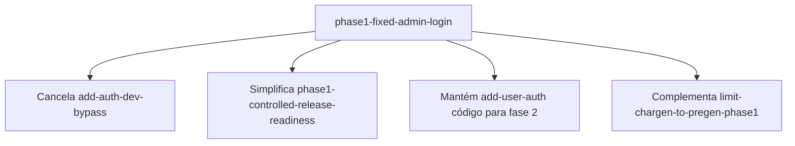

# Design: phase1-fixed-admin-login

## Context

**Estado atual**

- `add-user-auth` implementado: register, verify, JWT, ownership, starter no verify
- `dev_master.py`: usuário `dev@localhost` / `dev` só em development
- Frontend: `/login`, `/register`, `/verify-email`
- Produção exige `EMAIL_PROVIDER=smtp`

**Nova direção (fase 1)**

Um login fixo `admin` + `ADMIN_PASSWORD` para dev **e** deploy de teste controlado. Cadastro removido da experiência.

---

## Goals / Non-Goals

**Goals**

- Acesso protegido por senha configurável no servidor
- Zero SMTP / zero cadastro na fase 1
- Startup idempotente: admin + starter sempre prontos
- Flag `AUTH_MODE` para reativar multi-usuário na fase 2 sem reescrever

**Non-Goals**

- RBAC, múltiplos admins, rotação de senha via UI
- Aplicar `add-auth-dev-bypass`

---

## Decisions

### 1. Flag `AUTH_MODE`

```python
auth_mode: str = "fixed_admin"  # fixed_admin | multi_user
admin_password: str = ""        # ADMIN_PASSWORD — required when fixed_admin
```

| Modo | Register/verify | Login | Seed user |
|------|-----------------|-------|-----------|
| `fixed_admin` | 404 | admin + ADMIN_PASSWORD | `ensure_admin_user()` sempre |
| `multi_user` | Ativo (add-user-auth) | e-mail + senha | dev_master só em dev (opcional fase 2) |

**Default:** `fixed_admin` até fase 2 explícita.

### 2. Provisionamento do admin

```text
ensure_admin_user(db):
  1. Buscar admin@wfrp-solo.local
  2. Se ausente → create_user + email_verified_at = now
  3. Sempre → password_hash = hash(ADMIN_PASSWORD)
  4. Se sem starter → generate_random_starter_character()
```

Chamado no `lifespan` do FastAPI (como dev_master hoje).

**Alternativa rejeitada:** senha em plaintext no banco — sempre bcrypt do env.

### 3. Login API

Em `fixed_admin`:

- `LoginRequest.email` aceita `admin` ou `admin@wfrp-solo.local` (normalização)
- Senha comparada com `settings.admin_password`
- Ignora verificação de e-mail (admin sempre verified)
- Retorna JWT + user (sem starter no response se já existir — opcional)

### 4. Endpoints desabilitados

Decorator ou guard `require_multi_user_auth`:

```python
if settings.auth_mode != "multi_user":
    raise HTTPException(404, "Not available in phase 1")
```

Aplicar a: `POST /auth/register`, `/verify-email`, `/resend-verification`.

### 5. Validação de startup

**fixed_admin (dev e prod):**

```python
if not settings.admin_password or len(settings.admin_password) < 8:
    raise RuntimeError("ADMIN_PASSWORD required (min 8 chars)")
if settings.is_production and settings.jwt_secret.startswith("change-me"):
    raise RuntimeError("JWT_SECRET required in production")
# SMTP NOT required in fixed_admin
```

**multi_user + production:** manter regras atuais (SMTP obrigatório).

### 6. Frontend login

```tsx
// fixed_admin: só campo senha, username hidden "admin"
<form>
  <input type="hidden" name="email" value="admin" />
  <input type="password" label="Senha de acesso" />
</form>
```

Detectar modo via `GET /auth/config` (novo endpoint leve) ou `NEXT_PUBLIC_AUTH_MODE=fixed_admin`.

**Preferência:** endpoint `GET /auth/config` → `{ auth_mode, login_username }` para não duplicar flag no frontend.

### 7. Migração de `dev_master.py`

- Renomear/refatorar para `admin_user.py`
- Remover lógica só-development
- Deletar alias `dev` → `dev@localhost`
- Remover `normalize_login_email` special case para dev

### 8. Testes

| Teste | Modo |
|-------|------|
| Login admin OK / senha errada | `fixed_admin` (default fixture) |
| Register/verify | `multi_user` + monkeypatch |
| Ownership cross-user | `multi_user` only |
| E2E game loop | login admin com `ADMIN_PASSWORD` do test env |

### 9. Relação com outras changes



---

## Risks / Trade-offs

| Risco | Mitigação |
|-------|-----------|
| Testers sobrescrevem dados uns dos outros | Documentar; fase 2 com multi_user |
| Senha vazada no .env commitado | `.env` gitignored; fail-fast se default |
| Testes add-user-auth quebram | Fixture `AUTH_MODE=multi_user` nos testes específicos |

---

## Migration Plan

1. Add config + admin_user seed
2. Guard endpoints + update authenticate
3. Frontend login-only
4. Update docs + E2E
5. Marcar `add-auth-dev-bypass` como superseded/cancelled em openspec

Sem migration de banco. Usuários `dev@localhost` ou contas de teste antigas permanecem no sqlite mas não são usados.

---

## Open Questions

Nenhuma bloqueante.
