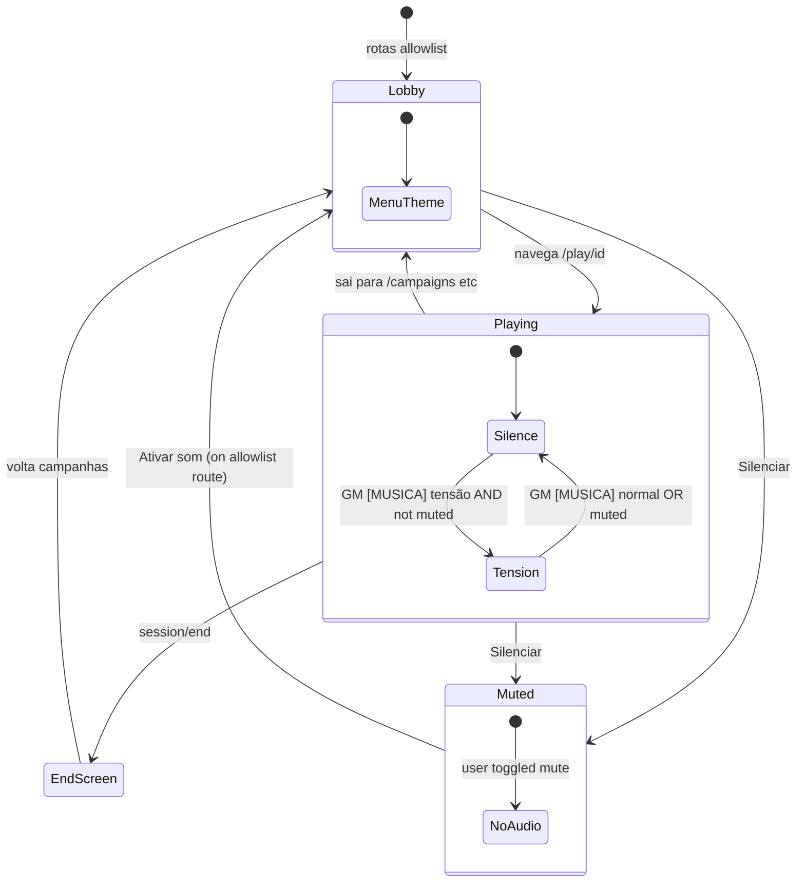

# Design: restrict-menu-audio-out-of-play

## Problema

```
Estado atual (denylist)
  pathname.startsWith("/play/")  → stop()
  else                           → playMenu()   ← qualquer rota não-/play/
```

Rotas como `/foo` futura tocarían menu sem querer. A regra de negócio é **allowlist**: menu só em telas de meta-jogo conhecidas.

## Solução

```
audioRoutes.ts
  IN_GAME_PREFIX = "/play/"
  MENU_AUDIO_ROUTES = Set(["/", "/login", ...])

  isInGameRoute(path)     → path.startsWith(IN_GAME_PREFIX)
  isMenuAudioRoute(path)  → MENU_AUDIO_ROUTES.has(normalize(path))

AudioRoutingProvider
  useEffect on pathname:
    if isInGameRoute      → stop()
    else if isMenuAudioRoute → playMenu()
    else                  → stop()

audioManager.play("menu")
  if isInGameRoute(window.location.pathname) → return (guard)
  if isMuted() → return (guard)

useAudioPlayer.setMood (com usePathname)
  if isMuted() → return (no play)
  "tensão" → play("tensao") only if isInGameRoute
  "normal" → stop()

audioManager muted state
  localStorage key: wfrp-audio-muted
  setMuted(true)  → stop() + persist
  setMuted(false) → persist + AudioRoutingProvider re-evaluates route
```

## Fluxo de navegação



## Normalização de pathname

- Remover trailing slash opcional: `/campaigns/` → `/campaigns`
- Query strings ignoradas (`usePathname()` já retorna path sem query)

## UI — botão Silenciar

```
game-header (play/[sessionId]/page.tsx)
  [timer/mode]  [⏸ Pausar]  [🔇 Silenciar | 🔊 Ativar som]
```

- Mesmo `disabled` que Pausar quando `loading || diceRolling` (opcional — pode permanecer clicável durante loading)
- Hook `useAudioMute()` expõe `{ muted, toggleMute }` para o botão

## Compatibilidade

- `AuthContext.logout()` continua chamando `stop()` — sem mudança
- `prepare:audio` / Docker — sem mudança
- Backend `scene_mood` — sem mudança; guarda só no frontend
