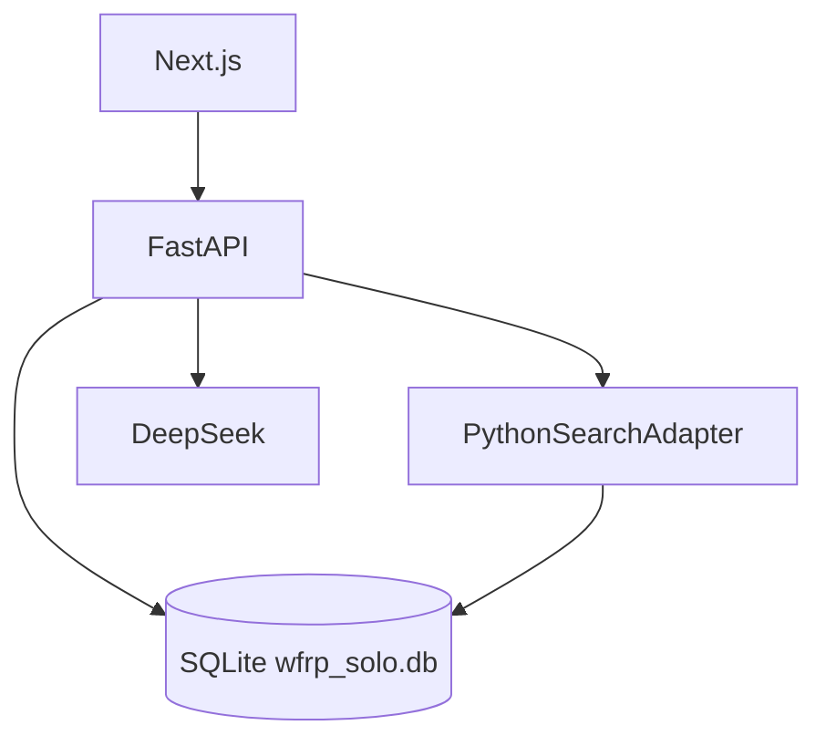

# Design: sqlite-only-database

## Context

**Implementação atual**

- Três perfis em `config.py`: `sqlite-dev`, `postgres`, `supabase`
- `memory.py`: `get_semantic_search()` retorna `PgVectorSearchAdapter` se `is_postgres`, senão `PythonSearchAdapter`
- `models.py`: tipo `Vector(384)` condicional vs `JSON` para embeddings
- `PythonSearchAdapter` + `simple_embedding()` já funcionam e têm testes (`test_memory_search.py`)
- Deploy Debian documentado com PostgreSQL + pgvector

**Motivação**

Simplificar stack para fase 1: um arquivo, zero Docker, deploy direto em VPS.

---

## Goals / Non-Goals

**Goals**

- SQLite como único backend de persistência
- Busca semântica via Python (já implementada)
- Documentação alinhada (README, Debian, schema)
- Remover dependências e código morto PostgreSQL

**Non-Goals**

- Sharding, réplicas, connection pooling
- Suporte dual SQLite+Postgres com feature flag

---

## Decisions

### 1. Config simplificada

```python
# config.py (proposto)
database_url: str = "sqlite+aiosqlite:///./wfrp_solo.db"
```

- Remover `database_profile`, `_PROFILE_DEFAULTS`, `is_postgres`
- `APP_ENV` independente: `development` | `production` (sem inferência do banco)
- `resolved_database_url` → renomear para propriedade direta ou validar prefixo `sqlite`

**Alternativa rejeitada:** manter `DATABASE_PROFILE=sqlite` como alias — adiciona indireção desnecessária.

### 2. Memória semântica

```python
def get_semantic_search() -> SemanticSearchAdapter:
    return PythonSearchAdapter()
```

- Deletar `PgVectorSearchAdapter` e SQL raw com `<=>`
- Embeddings armazenados como JSON array em `narrative_events.embedding`
- Limite de candidatos: buscar `limit * 4` eventos recentes, ranquear por cosine (já existe)

### 3. Models

```python
# Sempre JSON — sem import pgvector
embedding: Mapped[list[float] | None] = mapped_column(JSON, nullable=True)
```

### 4. Migrations

- Consolidar branches `if dialect == postgresql` em migrations existentes
- Novas migrations só SQLite
- `schema_patch.py` continua para ALTER TABLE em DBs dev antigos

### 5. Deploy Debian

```text
/opt/wfrp-solo/data/wfrp_solo.db   # volume persistente
DATABASE_URL=sqlite+aiosqlite:////opt/wfrp-solo/data/wfrp_solo.db
```

- Backup: `cp wfrp_solo.db wfrp_solo.db.bak`
- systemd: **1 worker** uvicorn (SQLite write lock)

### 6. Remoções

| Artefato | Ação |
|----------|------|
| `docker-compose.yml` | Delete |
| `asyncpg`, `pgvector` | Remove from requirements.txt |
| `DATABASE_PROFILE` em testes | `DATABASE_URL` sqlite in-memory ou file |
| Mensagens troubleshooting Postgres | README, check-dev |

### 7. Documentação `database-schema.md`

Reescrever seções:

- Visão geral: SQLite file-based
- Tipos: `TEXT`, `INTEGER`, `JSON` (não JSONB/UUID nativo — SQLAlchemy Uuid ok)
- Embeddings: coluna JSON, não vector type
- Remover Supabase/pgvector

---

## Migration Plan

1. Código: config → models → memory → main → schema_patch
2. Deps + delete docker-compose
3. Testes: grep `postgres|DATABASE_PROFILE` → atualizar
4. Docs batch update
5. Devs com `wfrp_solo.db` local: nenhuma ação (já sqlite)

Sem migração PostgreSQL → SQLite (não há dados prod em PG).

---

## Diagrama pós-mudança



---

## Open Questions

Nenhuma bloqueante.
