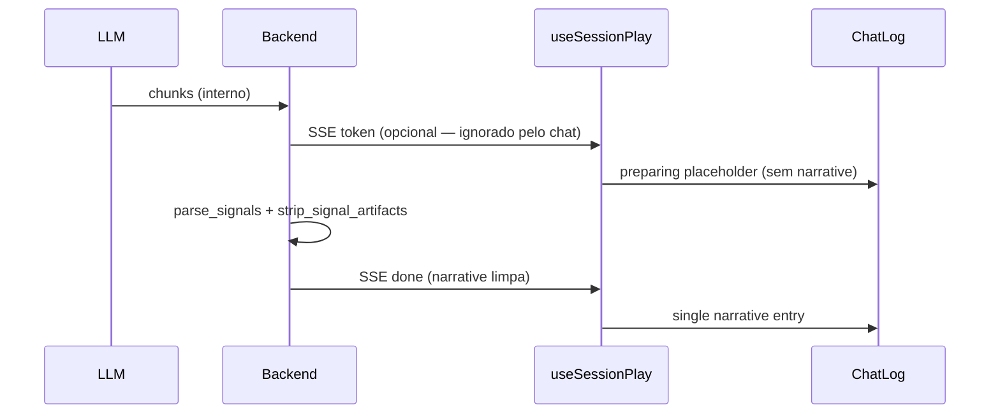

# Design: defer-gm-narrative-presentation

## Estado atual

```mermaid
sequenceDiagram
    participant LLM
    participant Backend
    participant useSessionPlay
    participant ChatLog

    LLM->>Backend: chunks
    Backend->>useSessionPlay: SSE token (raw)
    useSessionPlay->>ChatLog: narrative streaming=true (raw acumulado)
    Backend->>useSessionPlay: SSE done (narrative parsed)
    useSessionPlay->>ChatLog: remove streaming; add narrative final
```

Problemas:

1. Entre o primeiro `token` e o `done`, o jogador vê conteúdo bruto.
2. Se `parse_signals` falha (tag de fechamento errada), `parsed.narrative` ainda contém o bloco — ou pior, `parsed.narrative or llm_text` restaura tudo.

---

## Fluxo proposto



---

## Frontend

### `useSessionPlay.ts`

- Remover blocos que fazem `setEntries` em cada `token`.
- Manter `loading=true` (já desabilita input) e expor `preparingResponse=true` ou reutilizar `loading`.
- No `done`: append `{ kind: "narrative", content: finalResult.narrative }` se não vazio.

### `ChatLog.tsx` / `play/[sessionId]/page.tsx`

- Substituir ou complementar `session.gmNarrates` (“O Mestre narra…”) por **`session.preparingResponse`** (“Preparando a resposta”).
- Indicador visível **dentro** da coluna de chat (eyebrow sutil), não só abaixo do fold.

### Tipos `ChatEntry`

- Opcional: `{ kind: "preparing" }` efêmero — ou usar estado React fora do log (preferível: estado `isPreparing` no hook, sem poluir histórico).

---

## Backend — `signals.py`

### Parser estrito (mantido)

Regex atual exige `[/TAG]` exato — usado para extrair payload JSON válido.

### Strip tolerante (novo)

`strip_signal_artifacts(text: str) -> str`:

1. Reaplicar matches do parser estrito (já remove blocos válidos).
2. Remover blocos com fechamento typo conhecidos:
   - `[/NOVA_CAMAPANHA]`, `[/NOVA_CAMPANHA ]`, etc. via pattern alternativo para tags de campanha.
3. Remover blocos órfãos: `\[(MUSICA|TESTE|IMAGEM|...)\][\s\S]*?(?=\[/|\[(TESTE|...)|$)` quando JSON não parseável — **conservador**, só após falha do parser estrito.
4. Colapsar whitespace extra.

Ordem em orchestrator:

```python
parsed = parse_signals(llm_text)
narrative = strip_signal_artifacts(parsed.narrative)
# NUNCA: narrative or llm_text
```

### Extração de payload com typo no fechamento

Para `NOVA_CAMPANHA`, tentar regex alternativo **antes** do strip se o estrito falhou:

```python
NOVA_CAMPANHA_LOOSE = re.compile(
    r"\[NOVA_CAMPANHA\]\s*(\{[\s\S]*?\})\s*\[/NOVA_CAM[AÁ]NHA\]",
    re.IGNORECASE,
)
```

Permite processar campanha mesmo com typo no fechamento, **e** remove do texto player-facing.

---

## Caso reproduzido (bug report)

Entrada LLM (resumida):

```
[NOVA_CAMPANHA] { "tom": "...", ... } [/NOVA_CAMAPANHA]

Severin inclina a cabeça...
```

- Parser estrito: **não** casa `[/NOVA_CAMAPANHA]` → JSON fica em `narrative`.
- Com strip tolerante: bloco removido; JSON extraído por pattern loose; jogador vê só “Severin inclina…”.

---

## Streaming SSE — manter ou cortar tokens?

**Recomendação:** manter eventos `token` no wire (compatível com `synthetic-gm` streaming transport) mas frontend **ignora** para display. Alternativa futura: substituir por `{ type: "progress" }` heartbeat — out of scope unless needed.

---

## i18n

`pt-BR.json`:

```json
"preparingResponse": "Preparando a resposta…"
```

Deprecar ou reservar `gmNarrates` para outro contexto (ex.: pós-roll antes de narrate) se ainda usado.

---

## Testes

| Camada | Caso |
|--------|------|
| Backend | `parse_signals` + typo `[/NOVA_CAMAPANHA]` → signal extraído, narrative limpo |
| Backend | `[MUSICA]{...}[/MUSICA]` removido da narrative |
| Backend | `strip_signal_artifacts` não remove diálogo com colchetes normais |
| Frontend | tokens SSE não criam `ChatEntry` narrative até `done` |
| Frontend | após `done`, uma entrada narrative com texto sem `[NOVA_CAMPANHA]` |

---

## Arquivos afetados

| Arquivo | Mudança |
|---------|---------|
| `frontend/src/hooks/useSessionPlay.ts` | Defer reveal |
| `frontend/src/app/play/[sessionId]/page.tsx` | Indicador preparing |
| `frontend/messages/pt-BR.json` | Nova string |
| `backend/app/llm/signals.py` | strip tolerante + loose NOVA_CAMPANHA |
| `backend/app/services/gm_orchestrator.py` | Usar strip; remover `or llm_text` |
| `backend/tests/test_signals.py` (novo) | Casos de sanitização |
| `Docs/gm-system-prompt.md` | Reforço tags de fechamento |
