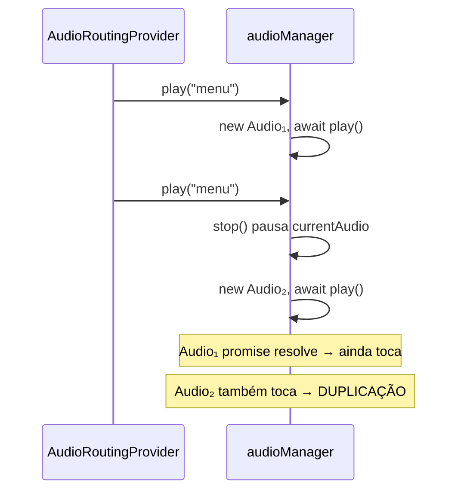
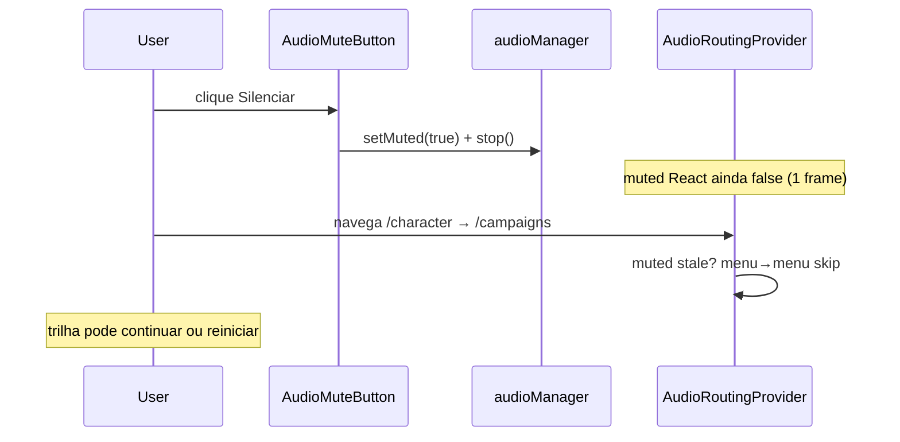

# Design: fix-audio-mute-routing-regression

## Duplicação de faixas (órfãos assíncronos)



**Correção:** `playGeneration` em `stop()`; no commit pós-`await`, se geração inválida → `audio.pause(); audio.src=""` no elemento **local** da promise (não só limpar `currentAudio`).

```ts
async play(category): Promise<void> {
  // guards...

  if (currentCategory === category && isPlaying()) return;

  stop(); // playGeneration++
  const gen = playGeneration;

  const audio = new Audio(...);
  try {
    await audio.play();
    if (gen !== playGeneration || muted) {
      audio.pause();
      audio.src = "";
      return;
    }
    if (category === "menu" && isInGameRoute(window.location.pathname)) {
      audio.pause();
      audio.src = "";
      return;
    }
    currentAudio = audio;
    currentCategory = category;
  } catch ...
}
```

**Importante:** `currentAudio = audio` só **após** `await` bem-sucedido e geração válida — não antes do `await` (evita `stop()` incompleto sobre instância errada).

## Regressão introduzida por `preserve-menu-audio-across-routes`



## Solução: playGeneration

```ts
let playGeneration = 0;

async play(category: AudioCategory): Promise<void> {
  if (muted) return;
  if (category === "menu" && isInGameRoute(...)) return;
  if (currentCategory === category && isPlaying()) return;

  const gen = ++playGeneration;
  this.stop(); // incrementa playGeneration de novo — usar gen local antes do stop
}
```

**Correção:** capturar `const gen = ++playGeneration` **depois** de passar guardas, chamar `stop()` que invalida plays anteriores, então `const myGen = playGeneration` após stop... 

Padrão mais limpo:

```ts
stop(): void {
  playGeneration++;
  // pause audio, clear refs, cancel retry listeners
}

async play(category): Promise<void> {
  // guards: muted, in-game+menu, idempotent same category playing
  
  stop(); // invalidates in-flight
  const gen = playGeneration;
  
  const audio = new Audio(...);
  try {
    await audio.play();
    if (gen !== playGeneration || muted) {
      audio.pause();
      audio.src = "";
      return;
    }
    if (category === "menu" && isInGameRoute(...)) {
      audio.pause();
      return;
    }
    currentAudio = audio;
    currentCategory = category;
  } catch ...
}
```

`stop()` incrementa geração → qualquer `await` pendente aborta no commit.

## Provider — guardas síncronas

```ts
import { audioManager } from "@/lib/audio/audioManager";

useEffect(() => {
  const path = pathname ?? "";
  const prev = prevPathRef.current;
  const pathChanged = prev !== path;
  prevPathRef.current = path;

  const isMuted = audioManager.isMuted();

  if (isMuted || isInGameRoute(path)) {
    stop();
    return;
  }

  if (!isMenuAudioRoute(path)) {
    stop();
    return;
  }

  if (
    pathChanged &&
    prev != null &&
    isMenuAudioRoute(prev) &&
    !isInGameRoute(prev)
  ) {
    return; // continuidade — só alcançado se !isMuted
  }

  playMenu();
}, [pathname, muted, playMenu, stop]);
```

Manter `muted` nas deps para reavaliar ao desmutar (mesmo pathname).

## Mute inconsistente “por tela”

O `AudioMuteButton` é o mesmo componente em `/login`, `AppShell` (personagens, campanhas, progressão, home) e `/play/`. Todos chamam `audioManager.setMuted()`.

O bug percebido como “funciona numa tela, noutra não” é o provider **reiniciando** `playMenu()` após navegação com `audioManager.isMuted() === false` no React por 1 frame, ou com `play()` in-flight ignorando mute.

**Regra:** toda avaliação de roteamento MUST consultar `audioManager.isMuted()` **antes** de qualquer `playMenu()`. Com mute ativo, `stop()` + return em **qualquer** rota allowlisted.

## Cancelar bindInteractionRetry

Em `stop()` e `setMuted(true)`:

```ts
function cancelInteractionRetry(): void {
  if (!interactionBound || typeof window === "undefined") return;
  // remover listeners — guardar refs dos handlers ou usar AbortController
  interactionBound = false;
  pendingCategory = null;
}
```

Implementação mínima: guardar referência `retryHandler` e chamar `removeEventListener` em `stop()`.

## Matriz de comportamento esperado

| Estado | Rota | Ação | Resultado |
|--------|------|------|-----------|
| unmuted | `/campaigns` | load | menu toca |
| unmuted | `/campaigns` → `/character` | nav | menu continua (sem restart) |
| unmuted | `/campaigns` → `/play/x` | nav | stop imediato |
| muted | `/campaigns` | load | silêncio |
| muted | qualquer lobby | clique Silenciar | silêncio |
| muted | `/character` → `/campaigns` | nav | silêncio |
| unmuted | `/play/x` → `/campaigns` | nav | menu inicia |
| muted | `/character` → `/campaigns` | nav | silêncio |
| unmuted | `/play/x` → `/campaigns` | nav | menu inicia |
| muted | `/play/x` → `/campaigns` | nav | silêncio até desmutar |
| unmuted | navegação rápida menu→menu | 2× play in-flight | **1** faixa audível (sem sobreposição) |

## Testes

| ID | Caso |
|----|------|
| T1 | `play()` in-flight + `setMuted(true)` → `isPlaying()` false após await |
| T2 | `setMuted(true)` + `play("menu")` → no-op |
| T3 | Mock: muted + menu→menu nav → `play` não chamado |
| T4 | Dois `play("menu")` sem mute → 1 instância Audio (regressão preserve) |
| T5 | `play("menu")` com pathname `/play/` → bloqueado |
| T6 | Dois `play("menu")` concorrentes (await artificial) → no máximo 1 `paused === false` |
| T7 | `setMuted(true)` em `/campaigns` + simular nav → `play` bloqueado |
