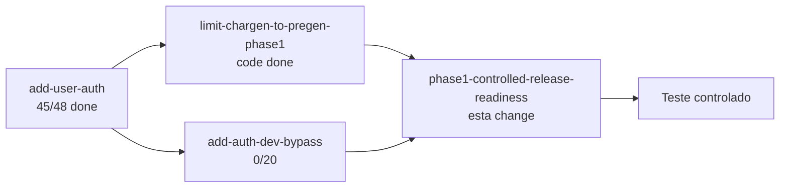

# Design: phase1-controlled-release-readiness

## Context

Auditoria em 2026-06-22 sobre o repositório SoloRPG para responder: *o que falta para liberar teste controlado?*

**Três “fases” coexistem na documentação:**

| Documento | “Fase 1” significa |
|-----------|-------------------|
| `Docs/development-order.md` | DeepSeek + DB local (infra técnica) |
| `limit-chargen-to-pregen-phase1` | Escopo de produto pós-auth (pregens only) |
| Esta change | **Release gate** — auth + pregen + loop jogável para testers externos |

Esta design doc usa **Fase 1 = release gate de produto** (auth + pregen + teste controlado).

---

## Goals / Non-Goals

**Goals**

- Inventário honesto done / partial / missing
- Matriz de ambiente dev vs produção
- Sequência de apply das changes existentes
- Gates objetivos antes de convidar testers

**Non-Goals**

- Reespecificar auth ou chargen (já em changes dedicadas)
- Arquitetura de microserviços ou CDN

---

## Matriz de ambiente

| Variável | Development (local) | Production (teste controlado) |
|----------|---------------------|-------------------------------|
| `APP_ENV` | `development` | `production` |
| `DATABASE_PROFILE` | `sqlite-dev` | `supabase` ou `postgres` |
| `EMAIL_PROVIDER` | `mock` (sem SMTP) | `smtp` (obrigatório) |
| `JWT_SECRET` | qualquer (dev) | ≥32 chars aleatórios; **fail-fast se default** |
| `CORS_ORIGINS` | `http://localhost:3000` | URL Vercel do frontend |
| `ENABLE_CUSTOM_CHARGEN` | `false` | `false` |
| `NEXT_PUBLIC_APP_ENV` | `development` | `production` |
| `NEXT_PUBLIC_ENABLE_CUSTOM_CHARGEN` | `false` | `false` |
| Auth verify | Bypass (`add-auth-dev-bypass`) | Código 8 dígitos por e-mail |
| Dev login | `POST /auth/login` com `dev` / `dev` (usuário master seedado) | Não provisionado |

---

## Mapa de dependências entre changes



---

## Decisions

### 1. Não criar nova change de feature

Gaps de produto já têm proposals:

- `add-auth-dev-bypass` — dev/prod segregation
- `limit-chargen-to-pregen-phase1` — wizard off

Esta change só adiciona **gates, docs e E2E** que nenhuma das outras cobre sozinha.

### 2. Prioridade de blockers

| Prioridade | Item | Motivo |
|------------|------|--------|
| P0 | Produção: JWT + SMTP + CORS + `APP_ENV=production` | Testers reais precisam verify |
| P0 | E2E com auth | Regressão silenciosa no loop |
| P0 | Validação manual auth (9.1–9.3) | Nunca executada |
| P1 | `add-auth-dev-bypass` | Velocidade de dev; não blocker para testers |
| P1 | Sync `limit-chargen` tasks + README | Docs mentem sobre wizard |
| P2 | `test_images.py` | Não afeta loop core |
| P2 | Rate limit login/register | MVP aceita risco baixo em teste fechado |
| P2 | Auth em image GET | UUID v4 — risco baixo mas documentar |

### 3. E2E strategy

Atualizar `game-loop.spec.ts`:

```
Option A (dev): beforeEach → `POST /auth/login` com `dev`/`dev` → set localStorage token
Option B (CI): register → read code from mock_sent_codes → verify → pregen → loop
```

Preferir **Option A** quando `add-auth-dev-bypass` aplicado; fallback Option B para CI sem dev endpoint.

### 4. Checklist manual unificado

Novo roteiro em `Docs/phase1-release-runbook.md`:

1. **Onboarding auth** (3 contas, isolamento)
2. **Pregen only** (wizard invisível, API 403)
3. **Campanha 1 sessão** (DeepSeek ou mock)
4. **Deploy staging** (env vars)

Atualizar `mvp-validation-checklist.md` com pré-requisito de login.

### 5. Startup guards (produção)

Em `main.py` lifespan ou `config` validator:

```python
if settings.is_production:
    if settings.jwt_secret.startswith("change-me"):
        raise RuntimeError("JWT_SECRET must be set in production")
    if settings.email_provider != "smtp":
        raise RuntimeError("EMAIL_PROVIDER=smtp required in production")
```

---

## Risks / Trade-offs

| Risco | Mitigação |
|-------|-----------|
| Tasks OpenSpec desatualizadas vs código | Sync nesta change antes de archive |
| Tester preso em verify se SMTP falha | Testar SMTP em staging antes do convite |
| E2E flaky com DeepSeek | Manter `LLM_PROVIDER=mock` no E2E |
| Deploy com `APP_ENV=development` | Fail-fast + doc em runbook |

---

## Open Questions

| Questão | Decisão proposta |
|---------|------------------|
| Testers usam DeepSeek real? | Sim para validação narrativa; E2E continua mock |
| Quantos testers fase 1? | ≤10; sem rate limit agressivo |
| SQLite em staging? | Não — Supabase para persistência real |
