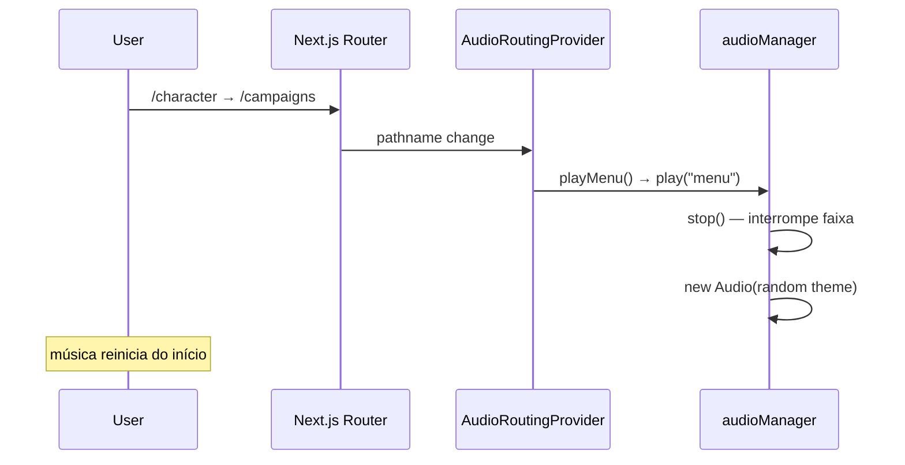
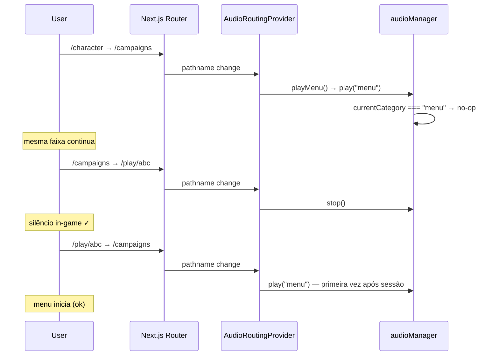

# Design: preserve-menu-audio-across-routes

## Fluxo atual (problemático)



O `AudioRoutingProvider` permanece montado no layout raiz — o singleton `audioManager` sobrevive à navegação. O problema é **reinicializar** o playback, não remontar o provider.

## Fluxo desejado



## Implementação

### 1. Estado em `audioManager`

```ts
let currentCategory: AudioCategory | null = null;

function isPlaying(): boolean {
  return currentAudio != null && !currentAudio.paused;
}

async play(category: AudioCategory): Promise<void> {
  // ... guards mute, menu+in-game ...

  if (currentCategory === category && isPlaying()) {
    return; // idempotente — mesma trilha continua
  }

  this.stop();
  currentCategory = category;
  // criar Audio, play()...
}

stop(): void {
  // ... pause, clear ...
  currentCategory = null;
}
```

`setMuted(true)` e `stop()` já zeram playback — `currentCategory` deve ser limpo junto.

### 2. `AudioRoutingProvider` — transições explícitas

Rastrear `prevPath` via `useRef`:

```ts
const prevPathRef = useRef<string | null>(null);

useEffect(() => {
  const path = pathname ?? "";
  const prev = prevPathRef.current;
  prevPathRef.current = path;

  if (muted || isInGameRoute(path)) {
    stop();
    return;
  }

  if (!isMenuAudioRoute(path)) {
    stop();
    return;
  }

  // Rota de menu: só iniciar se vindo de fora do menu ou de /play/
  const wasInGame = prev != null && isInGameRoute(prev);
  const wasMenu = prev != null && isMenuAudioRoute(prev);
  if (wasMenu && !wasInGame) {
  return; // já estava em lobby — audioManager idempotente cobre, mas evita call
  }

  playMenu();
}, [pathname, muted, playMenu, stop]);
```

**Nota:** Com idempotência em `play()`, o provider pode continuar chamando `playMenu()` em toda rota menu — o fix mínimo é só o `audioManager`. A otimização no provider é recomendada mas não obrigatória para cumprir o requisito.

### 3. Troca menu ↔ tensão (in-game)

`setMood("tensão")` chama `play("tensao")` — categoria diferente → `stop()` + novo áudio.  
`setMood("normal")` chama `stop()` — limpa `currentCategory`.

Sem mudança de contrato em `useAudioPlayer`.

## Testes

| Teste | Assert |
|-------|--------|
| `play("menu")` × 2 | `Audio.instances.length === 1` após ambos |
| `play("menu")` → `play("tensao")` | segundo elemento criado; primeiro pausado |
| `stop()` → `play("menu")` | novo elemento (reinício legítimo) |
| Provider mock: `/character` → `/campaigns` | `play` chamado no máximo 1× com instância única (se testar provider) |

## Riscos

| Risco | Mitigação |
|-------|-----------|
| `paused` true mas `currentCategory` set (tab background) | Idempotência checa `!paused`; retomar pode precisar de `play()` — edge case raro no MVP |
| `NotAllowedError` deixa `currentCategory` set sem áudio | Limpar `currentCategory` no catch ou só setar após `play()` resolve |
| Testes existentes assumem novo Audio a cada play | Atualizar mocks |
